嗯，用户让我用Graphviz来画这个Zig函数的流程图。首先，我需要理解这个函数的结构。这个函数叫做typeOfIndex，看起来是一个处理不同指令类型并返回对应类型的函数。函数内部有一个大的switch语句，根据不同的指令标签（tag）执行不同的逻辑，返回不同的Type。

首先，我需要确定流程图的结构。每个case分支应该对应一个流程节点。由于switch语句有很多分支，可能需要将相似的case分组处理，避免节点过多。例如，像.add、.sub这些二元操作可能共享同一个处理流程，返回air.typeOf(datas[...].bin_op.lhs, ip)。类似的，一元操作如.sqrt、.sin等也会有共同的处理步骤。

接下来，我需要考虑每个分支的处理逻辑。例如，当遇到.add时，流程会执行return air.typeOf(...)，而遇到.alloc时，返回datas[...].ty。需要将这些不同的处理路径转化为不同的节点和边。

然后，要注意函数中的一些特殊处理，比如对于.call指令，需要先获取callee_ty，再通过ip.funcTypeReturnType来得到返回类型。这可能需要额外的步骤节点。

另外，有些分支直接返回固定类型，比如.cmp_lt返回Type.bool，.ret返回Type.noreturn。这些可以直接在流程图中表示为节点。

还要处理那些可能导致流程终止的节点，比如unreachable的情况，或者返回void、usize等类型的情况。

由于代码中有很多分支，流程图可能会非常复杂。可能需要将相似的case合并到一个节点中，以提高可读性。例如，将所有二元操作合并到一个节点，一元操作合并到另一个节点，等等。

然后，需要考虑流程图的开始和结束节点。函数开始于typeOfIndex，结束于各个return语句。每个case分支都应该有一个边指向对应的返回节点。

此外，要注意一些分支内部还有嵌套的逻辑，比如.call指令需要先处理callee_ty，再调用funcTypeReturnType。这可能需要分解成多个步骤，在流程图中用多个节点表示。

最后，确保使用Graphviz的正确语法，比如用digraph定义图，节点用形状（如矩形、菱形等），边用箭头连接。可能需要将switch语句作为决策节点，然后根据不同的case分支到不同的处理节点，最终指向返回类型节点。

总结步骤：
1. 确定函数的主要结构：大的switch语句。
2. 将switch的每个case分组，合并相似的处理逻辑。
3. 为每个分组创建节点，处理不同的返回路径。
4. 处理特殊逻辑，如.call中的额外步骤。
5. 确保所有返回路径都有对应的节点和边。
6. 使用Graphviz语法绘制流程图，注意节点和边的连接。
================================================

```dot
digraph flowchart {
    node [shape=rectangle, fontname="Courier New", style=filled, fillcolor="#f0f0f0"];
    edge [fontname="Courier New"];

    start [label="typeOfIndex(air, inst, ip)", shape=ellipse];
    switch [label="Switch on air.instructions.items(.tag)[inst]", shape=diamond];

    bin_ops [label="Binary Operations\n(add/sub/mul/div etc)\nReturn typeOf(bin_op.lhs)"];
    un_ops [label="Unary Operations\n(sqrt/sin/cos etc)\nReturn typeOf(un_op)"];
    cmp_ops [label="Comparison Operations\nReturn Type.bool"];
    alloc_ops [label="Allocation/ReturnPtr\nReturn datas[inst].ty"];
    arg_op [label=".arg\nReturn arg.ty.toType()"];
    ty_pl_ops [label="Struct/Slice/Aggregate Ops\nReturn ty_pl.ty.toType()"];
    ty_op_ops [label="Bitcast/Load/IntCast etc\nReturn ty_op.ty.toType()"];
    noreturn_ops [label="Control Flow Ops\n(loop/br/ret etc)\nReturn Type.noreturn"];
    void_ops [label="Store/Prefetch etc\nReturn Type.void"];
    usize_ops [label="SliceLen/RetAddr\nReturn Type.usize"];
    call_ops [label="Call Operations\nResolve function return type"];
    elem_val_ops [label="Slice/Array Elem Val\nReturn ptr_ty.childType()"];
    atomic_ops [label="Atomic Operations\nReturn ptr_ty.childType()"];
    reduce_ops [label="Reduce Operations\nReturn vector child type"];
    select_op [label="Select\nReturn lhs type"];
    try_op [label="Try Operations\nReturn error union payload"];
    workgroup_ops [label="Workgroup IDs\nReturn Type.u32"];
    unreachable_ops [label="Inferred Alloc\nUnreachable"];
    misc_ops [label="TagName/ErrorName\nReturn slice_const_u8"];

    start -> switch;
    
    switch -> bin_ops [label=".add/.sub/.mul etc"];
    switch -> un_ops [label=".sqrt/.sin/.neg etc"];
    switch -> cmp_ops [label=".cmp_lt/.is_null etc"];
    switch -> alloc_ops [label=".alloc/.ret_ptr etc"];
    switch -> arg_op [label=".arg"];
    switch -> ty_pl_ops [label=".struct_field_ptr/.slice etc"];
    switch -> ty_op_ops [label=".not/.bitcast/.load etc"];
    switch -> noreturn_ops [label=".loop/.br/.ret etc"];
    switch -> void_ops [label=".store/.memset etc"];
    switch -> usize_ops [label=".slice_len/.frame_addr"];
    switch -> call_ops [label=".call/.call_always_tail"];
    switch -> elem_val_ops [label=".slice_elem_val/.array_elem_val"];
    switch -> atomic_ops [label=".atomic_load/.atomic_rmw"];
    switch -> reduce_ops [label=".reduce/.reduce_optimized"];
    switch -> select_op [label=".select"];
    switch -> try_op [label=".try/.try_cold"];
    switch -> workgroup_ops [label=".work_item_id etc"];
    switch -> unreachable_ops [label=".inferred_alloc"];
    switch -> misc_ops [label=".tag_name/.error_name"];

    // Shared return paths
    bin_ops -> end;
    un_ops -> end;
    cmp_ops -> end [label="Type.bool"];
    alloc_ops -> end;
    arg_op -> end;
    ty_pl_ops -> end;
    ty_op_ops -> end;
    noreturn_ops -> end [label="Type.noreturn"];
    void_ops -> end [label="Type.void"];
    usize_ops -> end [label="Type.usize"];
    call_ops -> end [label="func return type"];
    elem_val_ops -> end;
    atomic_ops -> end;
    reduce_ops -> end;
    select_op -> end;
    try_op -> end;
    workgroup_ops -> end [label="Type.u32"];
    misc_ops -> end [label="slice_const_u8"];

    end [label="Return Type", shape=ellipse];
}
```
