嗯，我需要为给定的Zig函数`checkBody`绘制一个流程图。首先，我需要理解这个函数的结构和逻辑流程。函数的主要目的是检查AIR（可能是一种中间表示）中的指令体是否符合某些类型约束，使用`checkType`和`checkRef`函数来验证。

函数开始遍历`body`中的每个指令索引`inst`。对于每个指令，它获取对应的`tag`和`data`，然后根据不同的`tag`执行不同的检查。每个`tag`对应不同的操作，例如`.arg`、`.add`、`.store`等等，每个操作可能有不同的数据字段需要检查。

我需要将这个过程转化为流程图。流程图应该从函数入口开始，遍历每个指令，然后根据不同的指令类型分支到不同的处理逻辑，最后返回结果。

首先，流程图的起点是函数开始，然后进入循环遍历每个`inst`。对于每个`inst`，根据`tag`进入不同的条件分支。例如，遇到`.arg`时检查`data.arg.ty`，遇到二元操作如`.add`时检查左右操作数等。

需要注意的是，有些分支可能包含嵌套的循环或递归调用`checkBody`，例如在处理`.block`、`.loop`等指令时，会递归调用`checkBody`来处理子指令体。

另外，某些情况会直接返回`false`，而其他情况则继续执行直到所有检查通过，最后返回`true`。

接下来，我需要将这些逻辑步骤用Graphviz的语法表示出来，确保每个判断节点和操作节点正确连接，并处理所有可能的分支情况。

可能需要将主要的`switch`结构分解成多个判断节点，每个`tag`对应不同的处理流程。同时，循环遍历`body`中的每个`inst`也是一个重要的节点。

需要特别注意递归调用`checkBody`的地方，这在流程图中可能需要表示为子流程或者使用子图来表示。

最后，确保所有可能的路径都被覆盖，并且流程图的箭头方向正确，没有遗漏任何返回点或条件分支。
================================================

```dot
digraph flowchart {
    node [fontname="Helvetica", shape=box, style="rounded"];
    start [label="Start checkBody", shape=ellipse];
    end [label="Return true", shape=ellipse];
    loop_start [label="For each inst in body"];
    check_inst [label="Get tag and data for inst"];
    switch_tag [label="Switch tag", shape=diamond];
    handle_arg [label="Check data.arg.ty"];
    handle_bin_ops [label="Check data.bin_op.lhs and rhs"];
    handle_ty_ops [label="Check data.ty_op.ty and operand"];
    handle_alloc [label="Check data.ty"];
    handle_block_loop [label="Check type and\nrecursively check sub-body"];
    handle_un_op [label="Check data.un_op"];
    handle_br_switch [label="Check data.br.operand"];
    handle_aggregate_init [label="Check array/struct elements"];
    handle_call [label="Check args and operand"];
    handle_cond_br [label="Check then/else bodies"];
    handle_switch_br [label="Check cases and else body"];
    return_false [label="Return false", shape=ellipse];
    continue_loop [label="Continue loop"];
    
    start -> loop_start;
    loop_start -> check_inst [label="inst exists"];
    check_inst -> switch_tag;
    
    switch_tag -> handle_arg [label=".arg"];
    switch_tag -> handle_bin_ops [label=".add, .sub, etc"];
    switch_tag -> handle_ty_ops [label=".not, .bitcast, etc"];
    switch_tag -> handle_alloc [label=".alloc, .ret_ptr"];
    switch_tag -> handle_block_loop [label=".block, .loop"];
    switch_tag -> handle_un_op [label=".ret, .is_null, etc"];
    switch_tag -> handle_br_switch [label=".br, .switch_dispatch"];
    switch_tag -> handle_aggregate_init [label=".aggregate_init"];
    switch_tag -> handle_call [label=".call variants"];
    switch_tag -> handle_cond_br [label=".cond_br"];
    switch_tag -> handle_switch_br [label=".switch_br"];
    switch_tag -> continue_loop [label="其他无需检查的指令"];
    
    handle_arg -> return_false [label="checkType fails"];
    handle_arg -> continue_loop [label="OK"];
    
    handle_bin_ops -> return_false [label="checkRef fails"];
    handle_bin_ops -> continue_loop [label="OK"];
    
    handle_ty_ops -> return_false [label="checkType/checkRef fails"];
    handle_ty_ops -> continue_loop [label="OK"];
    
    handle_alloc -> return_false [label="checkType fails"];
    handle_alloc -> continue_loop [label="OK"];
    
    handle_block_loop -> return_false [label="checkType fails\n或递归checkBody失败"];
    handle_block_loop -> continue_loop [label="OK"];
    
    handle_un_op -> return_false [label="checkRef fails"];
    handle_un_op -> continue_loop [label="OK"];
    
    handle_br_switch -> return_false [label="checkRef fails"];
    handle_br_switch -> continue_loop [label="OK"];
    
    handle_aggregate_init -> return_false [label="元素检查失败"];
    handle_aggregate_init -> continue_loop [label="OK"];
    
    handle_call -> return_false [label="operand/args检查失败"];
    handle_call -> continue_loop [label="OK"];
    
    handle_cond_br -> return_false [label="then/else body检查失败"];
    handle_cond_br -> continue_loop [label="OK"];
    
    handle_switch_br -> return_false [label="case/else检查失败"];
    handle_switch_br -> continue_loop [label="OK"];
    
    continue_loop -> loop_start [label="下一个inst"];
    loop_start -> end [label="所有inst处理完成"];
    
    return_false -> end [style=invis];  // 实际流程直接退出
    {rank=same; return_false; end}
}
``` 

该流程图特点：
1. 使用菱形节点表示分支判断（switch_tag）
2. 主要指令类型用独立节点表示（如handle_arg、handle_bin_ops等）
3. 递归调用通过handle_block_loop等节点表现
4. 所有失败路径直接指向return_false
5. 成功路径最终汇聚到循环继续
6. 使用不可见边处理返回逻辑，保持图形简洁