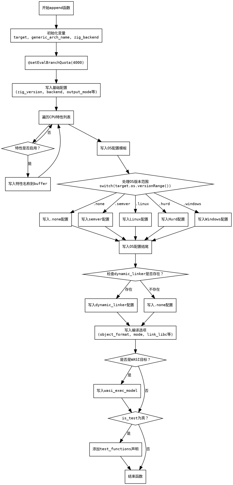

嗯，用户让我用Graphviz来画一个Zig函数的流程图。首先，我需要理解这个函数的结构和逻辑。这个函数名为`append`，看起来是用来生成一些内置配置信息的。函数接收一个`opts`和`buffer`，然后根据不同的条件将内容写入buffer中。

首先，函数开头定义了一些变量，比如`target`、`generic_arch_name`、`zig_backend`。然后使用`@setEvalBranchQuota(4000);`设置了一个编译时分支配额。接下来通过`buffer.writer().print`输出了一大段格式化的字符串，里面包含了很多占位符，比如`{s}`、`{p_}`，这些会被后面的参数替换。

之后，函数遍历`target.cpu.arch.allFeaturesList()`，检查每个特性是否启用，如果是，就将其名称写入buffer。这里有一个循环结构，需要注意循环内的条件判断。

然后处理操作系统的版本范围，根据不同的操作系统类型（如`.none`、`.semver`、`.linux`、`.hurd`、`.windows`），生成不同的配置信息。这里使用了大量的条件分支，每个分支对应不同的操作系统版本格式。

接着，函数继续处理动态链接器的配置，根据`target.dynamic_linker`是否存在，写入不同的内容。之后是关于链接libc、libcpp以及其他编译选项的设置，比如`link_libc`、`link_libcpp`等。

最后，如果是WASI目标，还会添加`wasi_exec_model`的配置。如果`opts.is_test`为真，则添加测试函数的相关代码。

整个函数的流程大致可以分为以下几个步骤：
1. 初始化并设置基本变量。
2. 生成基础配置信息（版本、后端、输出模式等）。
3. 遍历CPU特性并写入启用的特性。
4. 根据操作系统类型生成对应的版本范围信息。
5. 处理动态链接器配置。
6. 设置编译和链接选项。
7. 处理特定目标（如WASI）的额外配置。
8. 如果是测试模式，添加测试函数声明。

在绘制流程图时，需要将这些步骤用合适的图形表示，并用箭头连接它们。注意条件判断部分需要使用菱形判断框，循环结构也要正确表示。例如，处理操作系统版本范围时有多个switch case，每个case对应不同的处理流程，需要分别画出分支。

另外，函数中有多处错误处理（`try`关键字），这些在流程图中可能需要表示成可能的分支，比如失败时返回错误。不过根据函数签名，错误是通过返回`Allocator.Error!void`处理的，可能在流程图中不需要特别表示，除非有显式的错误处理逻辑。

最后，确保使用Graphviz的语法正确，比如正确的节点和箭头定义，避免使用Mermaid的语法。可能需要将各个步骤分解为节点，并用条件判断连接不同的路径。
================================================
