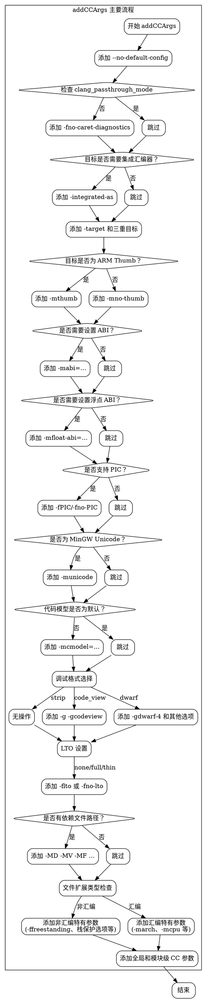

好的，我现在需要帮用户用Graphviz画一个函数addCCArgs的流程图。这个函数是用Zig写的，看起来挺复杂的。首先，我需要理解这个函数的结构和逻辑流程，然后才能转换成流程图。

首先，我会通读整个函数，看看有哪些主要的步骤。函数开始的时候有一些参数，然后根据不同的条件添加不同的命令行参数到argv数组里。例如，一开始有一个`--no-default-config`，然后根据是否处于clang_passthrough_mode来决定是否添加`-fno-caret-diagnostics`。接着还有很多条件判断，比如目标架构是否是Arm，是否支持PIC，调试格式的选择，LTO的设置等等。

接下来，我需要确定如何将这些条件分支和步骤转化为Graphviz的节点和边。每个主要的条件判断会对应一个决策节点，然后根据不同的条件走向不同的分支。例如，处理目标架构是否是Arm的部分，可能会有两个分支，分别对应添加不同的参数。

需要注意的是，这个函数中有很多嵌套的条件判断，比如在switch语句中又有if语句。这时候可能需要将这些嵌套结构分解成多个决策节点，确保流程图的清晰。例如，处理ext参数的switch语句，不同的文件扩展名会有不同的处理逻辑，每个case可能需要单独的路径。

另外，函数中有很多循环结构，比如遍历comp.libc_include_dir_list来添加多个`-isystem`参数。这时候在流程图中可能需要表示循环，但Graphviz中通常用节点和边来表示，可能需要用循环节点或者注释来说明。

还有，函数中有很多错误处理，比如try语句，但在流程图中可能不需要显式表示错误路径，除非用户特别要求。用户可能更关注正常流程。

在处理过程中，我需要确保每个步骤都被正确转换为节点，并且条件分支有明确的标签。例如，判断`if (!comp.clang_passthrough_mode and ext.clangSupportsDiagnostics())`会生成一个决策节点，两个分支分别对应条件成立和不成立的情况，然后各自添加不同的参数。

同时，要注意一些重复的模式，比如多次使用`try argv.append(...)`，可以将这些操作合并为一个节点，或者分开表示，具体取决于复杂度。例如，连续添加多个参数可能可以合并成一个节点，表示“添加多个参数”。

最后，需要确保整个流程图的结构合理，避免交叉和混乱的连线，保持可读性。可能需要将大的分支结构分开处理，或者使用子图来组织不同的部分。

总结来说，步骤应该是：
1. 识别函数中的主要步骤和条件分支。
2. 将每个步骤转换为流程图中的节点。
3. 用决策节点处理条件判断，分支到不同的路径。
4. 处理循环结构，可能需要用注释或循环节点。
5. 确保流程图的布局清晰，避免过多的交叉线。
6. 使用Graphviz语法编写代码，生成流程图。

可能需要多次调整结构，以确保逻辑正确且易于理解。现在，根据这些思考，开始绘制流程图。
================================================

该图展示了函数的主要分支逻辑：
1. 从核心参数初始化开始
2. 通过多个条件判断逐步添加不同编译参数
3. 处理调试信息/LTO/依赖文件等特性
4. 区分汇编文件和非汇编文件的特殊处理
5. 最终合并全局参数

复杂的条件分支（如架构特定选项）通过菱形决策节点表示，参数添加操作用矩形节点表示。实际实现中每个条件分支可能需要更细化的展开，但此图保留了主要逻辑框架。