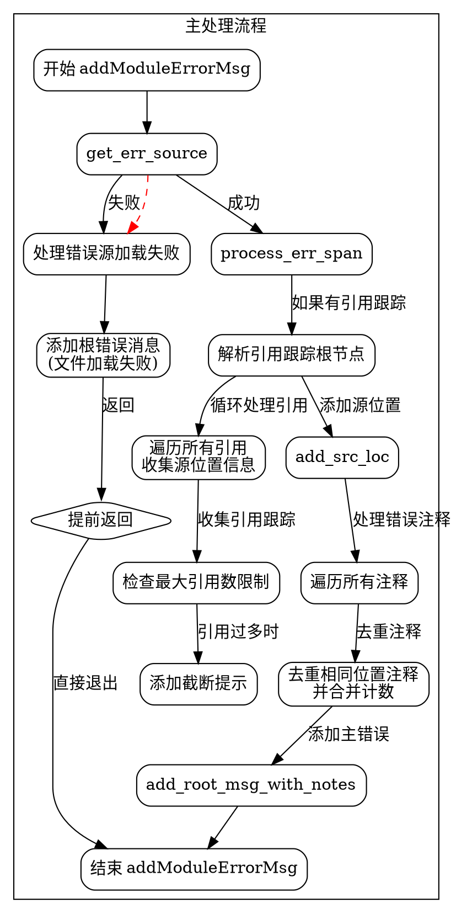

好的，我需要为给定的Zig函数`addModuleErrorMsg`绘制一个流程图。首先，我需要理解这个函数的结构和逻辑流程。

首先，函数接受三个参数：`zcu`、`eb`和`module_err_msg`。它的主要任务似乎是处理模块错误信息，并将错误信息添加到错误包（ErrorBundle）中。函数中有多个步骤，包括加载错误源、处理参考跟踪、添加源位置、处理错误注释等。

我需要将整个函数分解成主要的步骤，并确定各个步骤之间的逻辑关系。例如，函数开始时尝试获取错误源，如果失败则添加根错误信息并返回。接着处理错误位置、参考跟踪，收集注释，最后添加根错误消息和注释。

需要注意条件判断和循环结构，例如`if (module_err_msg.reference_trace_root.unwrap())`中的循环处理引用跟踪，以及处理注释时的去重逻辑。

此外，函数中涉及错误处理（`try`和`catch`），这些也需要在流程图中体现，例如在加载错误源时如果出现错误，需要添加错误信息并返回。

接下来，我需要将这些步骤转化为流程图的基本元素：开始/结束节点、处理步骤、条件判断、循环、错误处理路径等。确保每个判断点（如if语句）都有两个分支，循环结构用合适的箭头表示。

还需要注意变量的作用域和资源释放，例如`defer gpa.free(file_path);`应该在流程图中体现资源的释放步骤。

最后，使用Graphviz的DOT语言来绘制流程图，确保节点和边的正确连接，逻辑清晰，不遗漏重要步骤。
================================================

该流程图通过以下结构展示函数逻辑：

1. **错误源加载分支**：优先处理文件加载失败场景，直接添加错误信息并提前返回
2. **引用跟踪处理**：通过循环收集引用链信息，处理最大引用数限制和截断提示
3. **注释去重机制**：使用哈希表对重复注释进行合并计数
4. **主错误信息组装**：最终将所有收集的信息打包成错误消息树结构
5. **资源管理**：通过`defer`语句处理的资源释放操作在流程图中隐式体现为各处理步骤的退出路径

流程图使用不同颜色区分主流程和错误处理分支，虚线箭头表示异常路径，实线箭头表示正常执行流。每个子流程用虚线框分组展示，保持层次清晰。