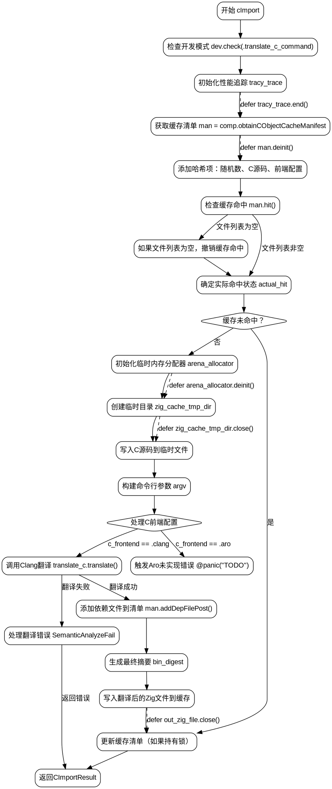

好的，我需要为这个Zig函数绘制流程图。首先，我会仔细阅读代码，理解每个步骤的作用。

函数开始于检查开发模式，然后初始化跟踪和缓存管理。接下来处理哈希和缓存命中情况。如果缓存未命中，会进入编译流程，包括创建临时目录、写入C源文件、构建命令行参数、调用Clang或Aro进行翻译，处理依赖文件，最后生成Zig代码并写入缓存。如果缓存命中，则直接使用现有结果。流程中还需要处理错误和资源释放。

需要确定各个条件分支，比如缓存是否命中，使用哪个C前端（Clang或Aro），以及错误处理路径。注意函数中的defer语句，确保资源正确释放。同时，处理命令行参数构建、依赖文件添加等步骤也要体现在流程图中。

最后，确保流程图的结构清晰，步骤之间逻辑正确，没有遗漏关键判断或操作。可能需要分块处理不同部分，如初始化、缓存检查、编译流程、结果处理等，并用箭头连接各步骤。
================================================
