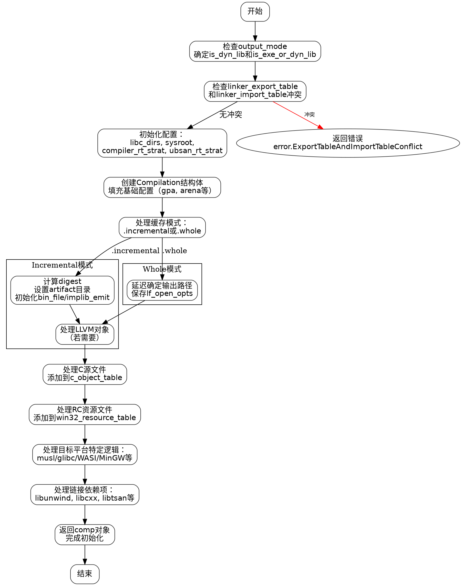

嗯，用户给了一个Zig语言的函数create，想要用Graphviz来画流程图。首先，我需要理解这个函数的结构和逻辑流程。这个函数看起来是用于创建一个编译实例，处理各种编译选项、配置、缓存、链接等步骤。

首先，我应该通读整个函数，确定主要的步骤和分支。函数开始处理output_mode，检查是否有冲突的选项，比如linker_export_table和linker_import_table。然后初始化一些配置，比如libc的目录，处理编译器运行时（compiler_rt）和ubsan运行时（ubsan-rt）的策略。

接下来，函数创建了一个Compilation结构体，填充各种字段，包括缓存设置、目标平台信息、链接选项等。然后根据不同的缓存模式（incremental或whole）进行不同的处理，比如设置输出目录、处理链接器输入等。

之后，处理C源文件和资源文件，将它们添加到工作队列中。还处理了不同目标平台（如Windows、musl、glibc、WASI等）的特定逻辑，比如加载库文件、生成导入库等。最后，处理编译器运行时库和其他依赖项，如libunwind、libcxx等。

为了画流程图，我需要将这些步骤分解成不同的节点，并用箭头表示流程的走向。注意条件判断和循环结构，比如switch语句、if条件等。每个主要操作或配置步骤应作为一个节点，分支条件作为决策点。

需要注意函数中有多个错误处理点（errdefer），这些可能在流程图中表示为错误处理路径。但可能用户主要关注正常流程，所以可能暂时忽略错误处理，或者用单独的分支表示。

另外，函数中有很多配置项和初始化步骤，可能需要将这些步骤合并为较大的块，避免流程图过于细化。例如，初始化Compilation结构体可以作为一个节点，处理C源文件作为另一个节点，处理不同目标平台的逻辑作为分支节点。

最后，确保使用Graphviz的语法，正确使用节点、边、子图等元素，保持流程图的清晰和可读性。
================================================
