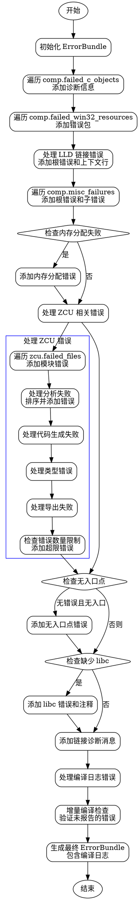

好的，我需要为提供的Zig函数`getAllErrorsAlloc`绘制一个流程图。首先，我需要仔细阅读并理解这个函数的逻辑，然后将其分解成不同的步骤和条件分支，最后用Graphviz的DOT语言表示出来。

首先，函数`getAllErrorsAlloc`的主要目的是收集并处理编译过程中产生的所有错误信息，最终生成一个错误包（ErrorBundle）。看起来它处理了多种错误来源，比如失败的C对象、Windows资源、链接诊断（LLD错误）、内存分配失败、模块错误（ZCU相关）等。

让我逐步分析函数的结构：

1. **初始化错误包**：使用`bundle.init(gpa)`初始化错误包，并在最后通过`defer bundle.deinit()`确保资源释放。

2. **处理失败的对象**：
   - 遍历`comp.failed_c_objects`，将每个诊断包添加到错误包中。
   - 遍历`comp.failed_win32_resources`，将每个错误包作为根添加到错误包中。

3. **处理LLD链接错误**：
   - 对于每个LLD错误，添加根错误消息，并为每个上下文行添加注释。

4. **处理其他杂项失败**：
   - 遍历`comp.misc_failures`，添加根错误消息，并处理子错误包作为注释。

5. **检查内存分配失败**：
   - 如果`alloc_failure_occurred`或链接诊断中存在内存分配失败标志，添加相应的根错误消息。

6. **处理ZCU（模块）相关的错误**：
   - 遍历`zcu.failed_files`，根据文件类型（ZIR/ZOIR）添加错误消息。
   - 处理分析失败、代码生成失败、类型错误、导出失败等。
   - 检查错误数量是否超过限制，并添加相关错误消息。

7. **处理无入口点的情况**：
   - 如果错误包为空且`no_entry_point_found`标志存在，添加相应的错误。

8. **处理缺少libc的情况**：
   - 如果`missing_libc`标志存在，添加错误消息及注释。

9. **添加链接诊断消息到错误包**。

10. **处理编译日志中的错误**：
    - 如果存在编译日志源，添加相关错误信息。

11. **增量编译的额外检查**：
    - 确保所有引用的分析单元没有未报告的失败。

12. **最终生成错误包**：
    - 将错误包转换为自有包，并包含编译日志文本。

接下来，我需要将这些步骤转化为流程图中的节点和分支。需要注意的是条件判断（如if语句）、循环（如for循环）以及可能的错误处理（try/catch）。

可能的节点和流程：

- 开始
- 初始化错误包
- 遍历失败C对象
- 遍历失败Win32资源
- 处理LLD错误
- 处理杂项失败
- 检查内存分配失败
- 处理ZCU相关错误（这里可能有多个子流程）
- 处理无入口点
- 处理缺少libc
- 添加链接诊断消息
- 处理编译日志错误
- 增量编译检查
- 生成最终错误包
- 结束

在Graphviz中，每个处理步骤可以表示为矩形节点，条件判断用菱形节点，循环可能需要用循环结构或注释表示。

需要注意的几点：

- 函数中有多个循环（for），每个循环处理不同的错误来源，这些需要分别表示。
- 条件判断如`if (comp.alloc_failure_occurred...)`、`if (comp.zcu)`等需要分支。
- 错误处理中的`try`可能隐含潜在的错误路径，但在流程图中可能不需要特别表示，除非有显式的错误处理分支。
- 增量编译检查部分是一个复杂的条件，可能需要单独的子图。

由于Graphviz不支持循环结构直接表示，但可以通过连接线来展示循环流程。对于每个for循环，可以用一个节点表示循环体，并在进入循环前有一个判断节点，检查是否还有元素需要处理。

可能的结构示例：

```
开始 -> 初始化错误包
初始化错误包 -> 处理失败C对象
处理失败C对象 -> 处理失败Win32资源
处理失败Win32资源 -> 处理LLD错误
处理LLD错误 -> 处理杂项失败
处理杂项失败 -> 检查内存分配失败
检查内存分配失败 -> 处理ZCU错误
处理ZCU错误 -> 处理无入口点
处理无入口点 -> 处理缺少libc
处理缺少libc -> 添加链接诊断消息
添加链接诊断消息 -> 处理编译日志错误
处理编译日志错误 -> 增量编译检查
增量编译检查 -> 生成最终错误包
生成最终错误包 -> 结束
```

每个处理步骤内部可能需要展开，例如处理ZCU错误包含多个子步骤，如遍历失败文件、处理分析错误等，这些可以用子图来表示。

在编写DOT代码时，需要定义各个节点，并用箭头连接它们的执行顺序。条件判断需要分支，例如：

```
检查内存分配失败 -> 添加内存分配错误 [label="是"]
检查内存分配失败 -> 处理ZCU错误 [label="否"]
```

对于循环，可以使用节点表示循环体，例如：

```
处理失败C对象 -> 遍历下一个C对象 [label="下一个"]
遍历下一个C对象 -> 处理失败C对象 [label="有更多"]
遍历下一个C对象 -> 处理失败Win32资源 [label="完成"]
```

不过，这样可能会使图表变得复杂。另一种方式是简单地用节点名称表示循环，例如“遍历所有失败C对象并添加错误”。

最终，需要确保流程图的逻辑正确，覆盖所有主要步骤和分支，同时保持可读性。
================================================


### 说明：
1. **流程图结构**：使用方向图（digraph）表示执行流程，节点按垂直方向（`rankdir=TB`）排列。
2. **关键节点**：
   - **菱形节点**：表示条件判断（如检查内存分配失败）。
   - **蓝色子图**：表示处理 ZCU 错误的内部流程。
   - **矩形节点**：表示具体操作步骤（如遍历数据结构、添加错误信息）。
3. **连接线标签**：标注条件分支的逻辑（例如“是/否”）。
4. **错误处理**：覆盖了内存分配失败、入口点缺失、libc 缺失等关键错误场景。
5. **ZCU 子流程**：将复杂的模块错误处理封装为子图，包含文件错误、分析失败、代码生成错误等子步骤。