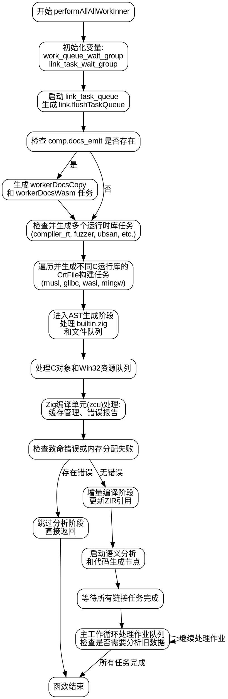

好的，我需要为提供的Zig函数`performAllTheWorkInner`绘制流程图。首先，我需要理解这个函数的整体结构和执行流程。

函数开始于声明一些变量，如`work_queue_wait_group`和`comp.link_task_wait_group`，并进行初始化和延迟等待。接下来，检查`comp.link_task_queue`是否启动，如果是，则生成线程池任务处理链接任务。

然后，函数处理与文档生成相关的任务，如`workerDocsCopy`和`workerDocsWasm`。之后，有一系列的`if`条件检查，用于生成不同的运行时库和对象文件，如`compiler_rt_lib`、`compiler_rt_obj`、`fuzzer_lib`等。这些任务通过`spawnManager`方法加入到`link_task_wait_group`中。

接下来是处理各种C运行库（如musl、glibc、wasi_libc、mingw）的Crt文件，根据不同的条件生成对应的构建任务。然后进入AST生成阶段，处理内置的`builtin.zig`文件，以及多个模块的依赖关系，生成AST和ZIR代码。

随后，处理C对象和Win32资源文件的编译任务，将它们加入线程池。如果存在Zig编译单元（`zcu`），则进行缓存管理、错误报告和多模块错误处理，确保所有文件成功加载。如果有致命错误或内存分配失败，则提前退出。

之后，根据是否启用增量编译，更新ZIR引用并进行语义分析。如果不需要单独的代码生成线程，等待所有链接任务完成，检查是否有未完成的预处理任务。最后，进入主工作循环，处理队列中的作业，直到所有任务完成。

在绘制流程图时，需要注意各个条件分支、循环结构以及并发任务的管理。需要将主要的步骤如初始化、任务生成、AST处理、错误检查、工作循环等作为流程图的节点，并用箭头表示执行顺序和条件分支。同时，考虑到并发任务的存在，可能需要用并行处理的分支来表示多个任务同时进行的情况。

需要确保流程图准确反映函数的控制流，包括所有的条件判断、循环和子过程调用。由于函数中涉及多线程和任务队列，流程图应尽量简化这些部分，突出主要的逻辑流程，避免过于复杂。
================================================
