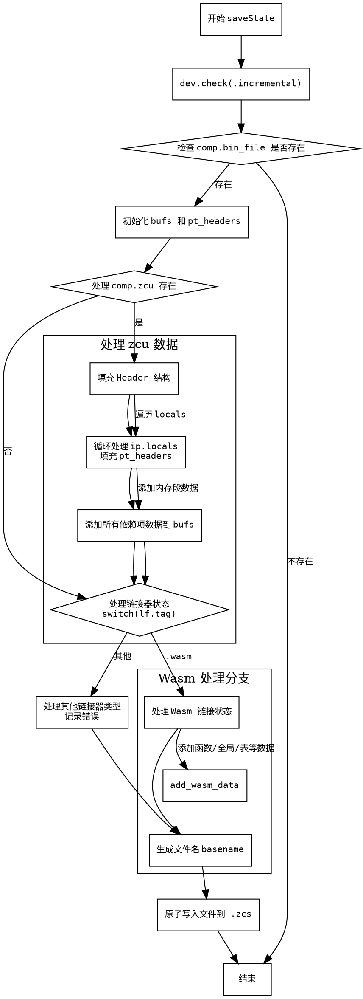

嗯，我需要帮用户画一个函数saveState的流程图，使用Graphviz。首先，我得仔细阅读这个Zig代码，理解它的结构和流程。这个函数看起来是用来保存编译状态的，特别是增量编译的状态。函数内部有很多条件判断和循环，还有针对不同文件类型的处理，比如Wasm。

首先，函数开始时会检查dev.check(.incremental)，这可能是一个调试或条件检查。然后检查comp.bin_file是否存在，如果不存在则返回。接着初始化一些缓冲区和数组，比如bufs和pt_headers。如果comp.zcu存在，就会处理intern pool的数据，填充header结构，并将各个依赖项的数据添加到缓冲区。之后，根据不同的文件类型（比如Wasm）处理链接器的状态，将各种数据添加到缓冲区。最后，将缓冲区的内容写入到一个原子文件中，以防止崩溃或断电导致的数据损坏。

我需要把这些步骤转化为流程图。流程图应该包括开始和结束节点，条件判断（比如if和switch语句），循环（比如for循环），以及各个处理步骤。需要注意的是，代码中有多个条件分支，比如if (comp.zcu)和switch (lf.tag)，这些需要作为决策节点。循环部分比如for (ip.locals)需要表示为循环结构。

可能的结构是：

1. 开始节点：函数入口。
2. 检查dev.check(.incremental)。
3. 检查comp.bin_file是否存在，如果不存在则返回。
4. 初始化bufs和pt_headers。
5. 处理comp.zcu存在的情况：
   a. 填充header结构。
   b. 循环处理ip.locals，填充pt_headers。
   c. 将各个依赖项的数据添加到bufs。
6. 根据lf.tag处理链接器状态，特别是Wasm的情况：
   a. 处理不同的数据段，添加到bufs。
7. 准备文件名，写入文件。
8. 结束节点。

需要注意处理条件分支时的流程分叉，比如switch语句中的不同case，特别是Wasm和其他情况。同时，循环结构需要正确表示，比如for循环处理每个local。此外，错误处理和defer语句可能也需要考虑，但流程图可能不需要体现错误处理的具体路径，除非有显式的错误分支。

现在，我需要将这些步骤用Graphviz的DOT语言表示出来。确保节点之间的箭头正确连接，条件判断使用菱形节点，处理步骤用矩形节点，循环可能需要用循环结构或者注释说明。
================================================
