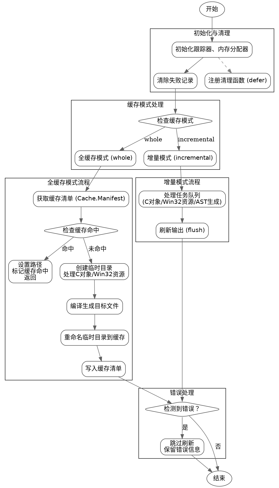

嗯，我需要为这个Zig函数画一个流程图。首先，我得仔细阅读这个函数，理解它的各个步骤和逻辑结构。这个函数是update，属于Compilation结构体的方法，主要处理编译过程中的缓存机制，包括全缓存模式（whole）和增量模式（incremental）。

首先，函数开始时会初始化一些资源，比如跟踪器（tracy_trace）、内存分配器（arena_allocator）。然后清除之前的失败记录，设置缓存命中标志为false。接下来根据不同的缓存模式（whole或incremental）执行不同的逻辑。

在全缓存模式下，函数会尝试获取缓存清单（Cache.Manifest），检查缓存是否命中。如果命中，就直接使用缓存的结果，设置相关路径并返回。如果未命中，则需要创建临时目录进行编译，处理C对象和Win32资源，生成目标文件，并最终将临时目录重命名为缓存目录中的正确位置。

在增量模式下，函数则直接进行编译工作，处理各种任务队列，包括C对象、Win32资源、AST生成、模块分析等，最后刷新输出。

此外，函数还处理错误情况，比如在重命名临时目录时可能出现的错误，以及在写入缓存清单时的错误处理。最后，根据不同的缓存模式调用flush函数，完成最终的输出。

流程图需要涵盖这些主要步骤，包括条件判断（如缓存模式的选择、缓存命中与否）、循环处理任务队列、错误处理分支、资源初始化和释放等。同时要注意函数中可能存在的并行处理或异步操作，但根据代码结构，这里主要是顺序执行，可能涉及多线程的任务队列处理，但流程图应简化这些细节，突出主要逻辑流。

需要将整个流程分解成多个步骤，用不同的图形表示开始、结束、处理步骤、条件判断、输入输出等。例如：

1. 开始
2. 初始化资源和清理
3. 检查缓存模式（whole或incremental）
4. 对于whole模式：
   a. 获取缓存清单
   b. 检查缓存命中
   c. 命中则设置路径并返回
   d. 未命中则创建临时目录，处理编译任务
   e. 处理C对象和Win32资源
   f. 生成目标文件，重命名目录到缓存
   g. 写入缓存清单
5. 对于incremental模式：
   a. 处理编译任务
   b. 刷新输出
6. 处理错误情况
7. 结束

每个步骤之间用箭头连接，条件判断使用菱形框。需要确保所有可能的路径都被覆盖，包括错误处理的分支。同时，注意函数中的defer语句，如arena_allocator的释放和man的清理，这些在流程图中可能需要表示资源管理的步骤。

可能还需要考虑函数中调用其他函数的部分，比如addNonIncrementalStuffToCacheManifest、performAllTheWork、flush等，但这些在流程图中可以简化为单个步骤，除非有特别重要的子流程需要展开。

总之，流程图需要清晰展示函数的执行流程，包括主要决策点和处理步骤，以及错误处理路径，确保逻辑正确且易于理解。
================================================
