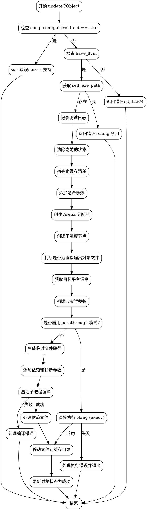

好的，我需要为给定的Zig函数`updateCObject`绘制一个流程图。首先，我需要理解这个函数的主要逻辑和各个条件分支。

首先，函数开始时检查`comp.config.c_frontend`是否为`aro`，如果是，则返回错误，因为aro还不支持编译C对象。接着检查是否没有LLVM支持，如果是，返回错误。然后获取`self_exe_path`，如果不存在，返回错误。之后，记录调试日志，并处理之前可能的失败状态。

接下来，函数初始化缓存清单，添加各种哈希值，包括预处理模式、输出位置等。然后处理C源文件的哈希。之后，创建了一个Arena分配器，处理子进度节点。

然后判断是否为直接输出对象文件的情况（即只有一个C文件且输出模式为Obj）。根据不同的情况生成输出文件名和后缀。接着根据目标平台确定文件扩展名。

之后，检查是否需要直接执行clang（passthrough模式），如果可以执行，则构建参数并执行clang，处理可能的错误。如果不能执行，则处理编译参数，生成临时文件路径，并处理依赖文件和诊断文件。

然后，根据不同的预处理模式添加不同的命令行参数，执行clang子进程，处理其输出和错误。如果编译成功，处理依赖文件，更新缓存清单，最后将生成的对象文件移动到正确的缓存位置，并更新对象状态。

在这个过程中，有多个条件分支，例如检查是否启用passthrough模式、是否生成依赖文件、处理不同的预处理模式等。每个分支都需要在流程图中正确表示。

需要注意的是，流程图应使用Graphviz语法，节点和边的连接要准确反映函数中的逻辑流程。可能的错误处理和返回路径也需要包括在内。例如，当检查到aro或没有LLVM时，流程直接结束并返回错误。当执行clang失败时，处理错误信息并返回。

此外，函数中的一些延迟操作（如`defer`语句）可能需要在流程图中适当表示，例如关闭文件句柄或删除临时文件。但由于这些是资源管理操作，可能在流程图中简化为步骤后的清理动作。

总结步骤：
1. 开始函数。
2. 检查前置条件（aro、LLVM、self_exe_path），失败则返回错误。
3. 初始化缓存和日志。
4. 处理之前的失败状态。
5. 配置编译参数和输出路径。
6. 判断是否为直接执行clang的情况，如果是则执行并处理结果。
7. 否则，准备编译参数，生成临时文件。
8. 执行clang编译，处理可能的错误。
9. 处理依赖文件和诊断文件。
10. 更新缓存清单，移动生成文件到正确位置。
11. 更新对象状态，结束流程。

需要确保每个判断条件都有对应的分支，如条件满足时的流程和未满足时的流程。同时，异常路径（如编译失败）应正确连接到错误处理步骤。
================================================
