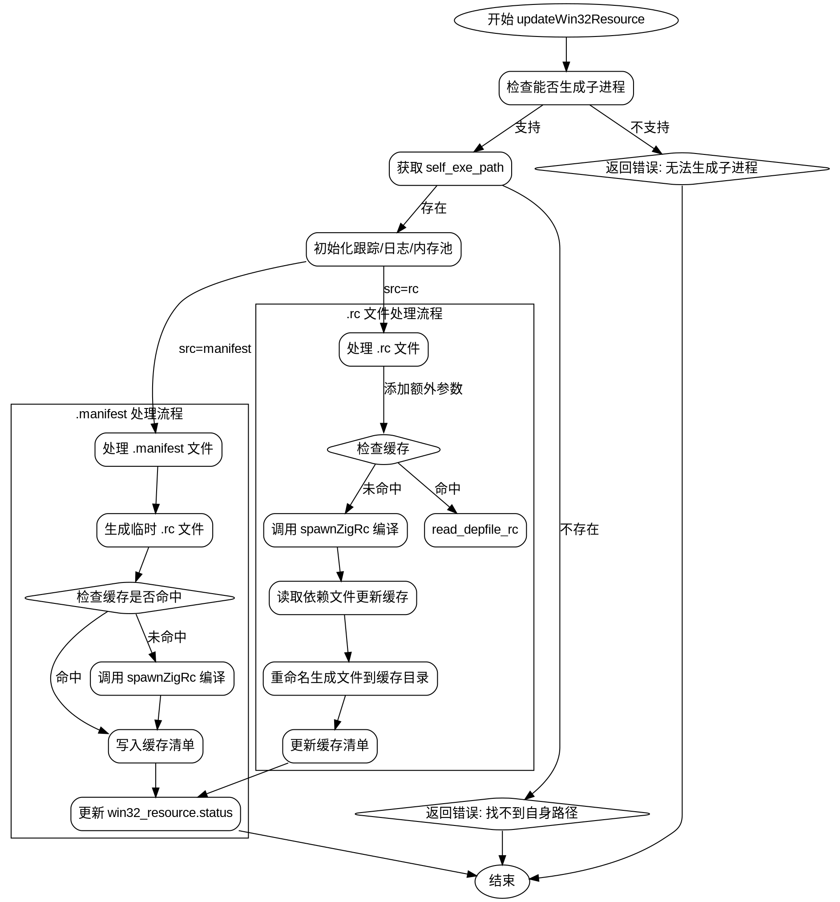

好的，我需要帮助用户将给定的Zig函数转换为Graphviz流程图。首先，我要仔细阅读并理解这个函数的逻辑结构。函数名是updateWin32Resource，看起来是处理Windows资源编译的。

首先，函数开始检查是否支持子进程生成，如果不支持就返回错误。然后获取自身可执行路径，处理跟踪和日志。接着根据资源类型（.rc或.manifest）选择不同的处理路径。对于.manifest文件，生成.rc文件并调用spawnZigRc编译成.res文件。对于.rc文件，处理依赖文件和缓存，同样调用spawnZigRc编译，并处理依赖关系。

接下来，我需要确定流程中的主要分支和步骤。主要分支有两个：处理.manifest文件和处理.rc文件。每个分支都有各自的步骤，比如生成中间文件、调用编译命令、处理依赖、更新缓存等。

在绘制流程图时，需要注意条件判断和循环结构。例如，函数中有多个if语句，比如检查文件类型、是否命中缓存等。每个条件判断都会导向不同的处理流程。此外，错误处理和资源清理（如defer语句）也需要在流程图中体现。

我需要确保流程图中的节点清晰表示每个操作步骤，如函数调用、条件判断、循环、错误处理等。同时，要使用Graphviz的语法正确表示这些元素，比如使用菱形表示条件判断，矩形表示处理步骤，箭头表示流程方向。

可能遇到的挑战是处理嵌套的条件和多个子流程，比如在.manifest处理中生成.rc文件、调用编译命令，以及处理缓存。需要将这些步骤分解成独立的节点，并正确连接它们，确保流程的逻辑正确性。

另外，需要注意函数中的错误处理路径，比如failWin32Resource的调用，这些应该作为流程中的终止节点或错误出口。同时，资源释放（如defer语句）应该在流程图中适当的位置体现，比如关闭文件或释放锁。

最后，验证流程图是否覆盖了函数的所有主要路径，没有遗漏重要的步骤或条件。确保每个分支都有明确的开始和结束，流程图的布局合理，易于理解。
================================================

该流程图使用以下约定：
- 菱形节点表示条件判断
- 普通矩形表示操作步骤
- 子图区分不同资源类型的处理流程
- 箭头标注关键分支条件
- 包含错误处理路径
- 展示缓存处理机制
- 显示最终状态更新环节

可以通过Graphviz工具渲染为矢量图，推荐使用`dot -Tsvg`命令生成可缩放矢量图。