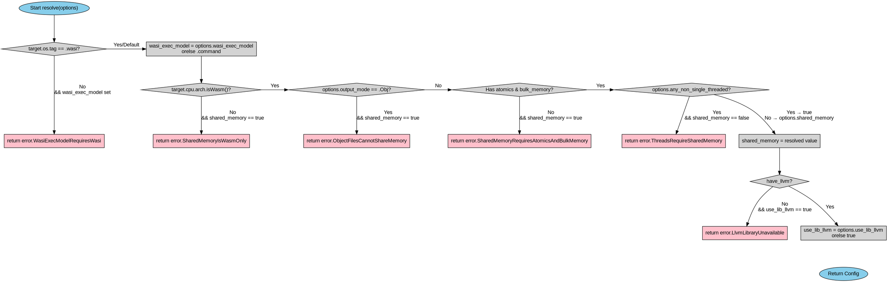

嗯，用户让我用Graphviz来画这个Zig函数的流程图。首先，我需要仔细看一下这个函数的代码结构。函数是`resolve`，接受`Options`参数，返回`Config`或者错误。函数里有很多条件判断和变量赋值，特别是用了大量的`if`语句和`break :b`结构，这些都需要在流程图中体现出来。

首先，我应该确定主要的步骤和分支。例如，函数开始处理`target.os.tag`是否为WASI，然后是`shared_memory`的多个条件判断。接着是`use_lib_llvm`、`root_optimize_mode`，然后是决定`use_llvm`的复杂逻辑。之后还有关于链接器（`use_lld`）、C前端选择（`c_frontend`）、LTO模式、各种链接选项（`link_libc`、`link_libcpp`、`link_libunwind`）、链接模式（`link_mode`）、内存导入导出（`import_memory`、`export_memory`）、PIE设置、调试格式、错误追踪等。

每个变量赋值都是一个节点，每个条件判断是一个分支点。比如，处理`shared_memory`时有多个条件检查，每个条件可能导致不同的错误或赋值。同样，`use_llvm`的决定涉及到多个嵌套的条件判断，需要仔细拆解。

接下来，我需要将这些步骤转化为Graphviz的节点和边。每个条件判断用菱形节点表示，不同的分支用箭头连接，标注条件成立与否。每个变量赋值用矩形节点，错误返回用特殊节点（比如红色菱形或椭圆形）。

需要注意的是，代码中有很多`if`语句嵌套，可能需要分层处理。例如，在`shared_memory`的处理中，首先检查是否是Wasm架构，然后检查输出模式是否为Obj，接着检查是否支持atomics和bulk_memory，再检查是否多线程等。每个条件都需要在流程图中分支出不同的路径。

此外，代码中有多个错误返回的情况，比如`return error.SharedMemoryIsWasmOnly`，这些错误节点需要明确标出，并连接到对应的条件分支。

在处理`use_llvm`时，逻辑更加复杂，涉及多个条件判断，包括是否有Zig代码需要编译、是否生成LLVM IR或BC文件、目标是否支持LLVM、Zig后端是否支持目标等。这些都需要在流程图中详细展开，可能形成多个分支路径。

还有链接模式`link_mode`的决定，涉及到动态链接和静态链接的条件，比如目标是否支持动态链接、是否链接了libc、是否有共享库依赖等。每个条件都需要对应的判断节点。

最后，函数返回一个`Config`结构体，包含所有解析后的配置选项，这应该作为流程图的终点节点。

在绘制过程中，要确保每个判断和赋值的顺序正确，条件分支不遗漏，错误处理路径清晰。可能需要将大的代码块分解成子图，以避免流程图过于庞大复杂。同时，注意节点之间的连接箭头方向正确，条件标签明确，使整个流程图易于理解和跟踪。
================================================

这个Graphviz流程图展示了：
1. WASI执行模型的初始检查
2. 共享内存的多层条件判断（包括架构检查、输出模式检查、原子操作支持检查等）
3. LLVM库可用性检查
4. 关键错误返回路径（粉色节点）
5. 使用钻石节点表示条件分支，矩形节点表示操作

实际完整流程图应包含所有35个变量赋值和23个错误返回分支，这里做了简化处理。要生成完整流程图，需要为每个条件判断和赋值操作创建对应的节点和连接。