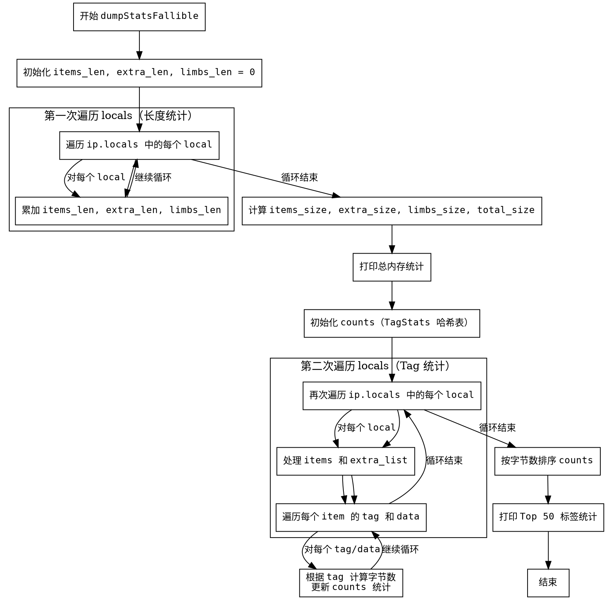

嗯，我现在需要帮用户用Graphviz画出他们提供的Zig函数`dumpStatsFallible`的流程图。首先，我得仔细理解这个函数的功能和结构。

函数开始部分初始化了几个变量`items_len`, `extra_len`, `limbs_len`，然后遍历`ip.locals`来累加这些长度。接着计算各个部分的大小，然后输出总大小和各个部分的大小。这部分应该是初始化统计变量，然后处理本地数据，最后打印结果。

接下来是统计每个Tag的出现次数和占用的字节数。这里使用了`TagStats`结构体和一个哈希表`counts`来记录每个Tag的数据。然后再次遍历`ip.locals`，对于每个item，根据不同的Tag类型计算对应的字节数，并更新哈希表中的统计信息。

之后，定义了一个`SortContext`来对统计结果进行排序，按字节数从高到低排序，然后打印前50个Tag的信息。

现在，我需要将这些步骤转化为流程图。流程图的开始应该是函数入口，然后是初始化变量，遍历locals累加长度，计算总大小，打印统计信息。接着是初始化统计结构，再次遍历locals处理每个Tag，计算字节数并更新统计。然后排序统计结果，最后打印Top 50的标签。

需要注意的是，循环结构需要用Graphviz的节点和箭头来表示，比如循环遍历locals的部分可能会有两个循环：一个用于累加长度，另一个用于处理每个Tag。每个条件判断（比如不同的Tag类型对应的不同字节计算）可能需要分支，但在这个函数中，处理不同Tag的代码是通过switch语句处理的，这在流程图中可能需要简化为一个处理块，或者根据不同的分支展开。

不过，由于函数中的Tag处理非常复杂，包含许多不同的case，如果在流程图中详细展开每个case，会导致图表过于复杂。因此，可能需要将这些处理简化为一个“处理Tag并更新统计”的步骤，而不详细展示每个case的分支。

另外，排序和打印Top 50的部分相对独立，可以放在流程图的最后部分。

现在，我需要将这些步骤用Graphviz的语法组织起来，确保逻辑正确，步骤清晰。需要注意节点之间的连接顺序，循环结构可能需要使用子图或者注释来表示。

可能的结构：

1. 函数开始
2. 初始化items_len, extra_len, limbs_len为0
3. 循环遍历ip.locals，累加各长度
4. 计算items_size, extra_size, limbs_size和total_size
5. 打印总大小和各部分大小
6. 初始化counts哈希表
7. 再次循环遍历ip.locals中的每个local
   a. 获取items和extra_list
   b. 遍历每个item的tag和data
   c. 根据tag计算bytes，更新counts中的统计
8. 创建SortContext并按字节数排序
9. 打印Top 50的tags及其统计信息

在Graphviz中，循环可以用节点和箭头表示，例如循环开始节点，循环体，循环结束后的节点。可能需要用条件节点或者注释来说明循环的存在。

现在，我需要将这些步骤转化为Graphviz的节点和边，注意正确的流程顺序，并合理处理循环结构。
================================================
