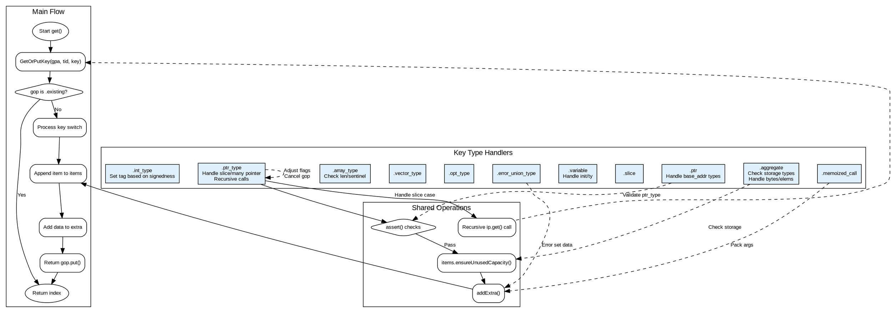

嗯，用户让我用Graphviz画一个Zig函数的流程图，函数是InternPool.zig里的get函数。首先，我需要理解这个函数的结构和逻辑流程。看起来这个函数处理不同类型的键（key），并根据不同的情况向items添加数据。函数中有很多switch语句，处理各种key的类型，比如.int_type、.ptr_type等等。

首先，我应该确定函数的主要流程。函数开始于获取或创建gop（可能是一个GetOrPut的结果），然后根据gop的状态决定是返回现有的还是继续处理。接下来，根据不同的key类型，执行不同的操作，比如处理整数类型、指针类型、数组类型等等。每个case里可能有条件判断、循环、递归调用等。

接下来，我需要将这些逻辑转化为流程图。流程图通常包括开始节点、结束节点、判断节点、处理步骤、可能的子流程等。由于这个函数非常复杂，包含大量的分支，可能需要分层次来组织，比如主流程下展开每个key类型的处理子流程。

需要注意的是，Graphviz使用DOT语言，所以需要正确使用节点和边的语法。每个判断点用菱形节点，处理步骤用矩形节点，开始和结束用椭圆形。可能需要将大的switch case分解成多个子图，避免节点过多导致难以阅读。

另外，函数中有递归调用，比如在处理.ptr_type时，如果flags.size是.slice，会递归调用ip.get，这时候在流程图中需要表示这种递归关系，可能用一个节点指向开始节点或者某个中间节点。

由于代码中有很多错误检查和断言（assert），这些也应该在流程图中体现，作为判断分支。例如，处理.ptr_type时有两个assert，这可以表示为条件判断，如果不满足则流程终止或抛出错误。

处理每个key类型的具体步骤需要详细展开，但也要注意不要过于细化，否则图表会变得非常庞大。可能需要将每个key类型的处理作为一个子流程，在主流程中简要表示，然后在子图中详细展开。

另外，函数中有一些共同的步骤，比如调用items.appendAssumeCapacity，addExtra等，这些可以在流程图中用通用节点表示，避免重复。

最后，需要确保流程图的正确性和可读性，合理使用注释和分组，让读者能够理解整个函数的执行路径。
================================================
