嗯，我现在要画这个函数的流程图。首先，我得仔细看看这个函数的逻辑。函数的名字是getCoerced，看起来是用来处理类型强制转换的。函数的参数有ip、gpa、tid、val和new_ty。返回值是Index或者错误。

首先，函数一开始检查旧类型和新类型是否相同，如果相同就直接返回val。这部分应该是一个条件判断，是的，流程图里会有一个判断框。

接下来是switch语句，根据val的不同情况处理。比如，如果是.undef，就返回新的undef类型。如果是.null_value，需要检查新类型是否为可选类型或指针类型，再分别处理。这部分会有多个分支，尤其是处理指针类型时的不同size情况，比如slice需要构造slice结构。

然后处理其他情况，比如func_decl、func_instance等，这里可能递归调用getCoercedFuncDecl或者getCoercedFuncInstance。这部分需要分支处理不同的tag。

接着是对不同类型的处理，比如int、float、enum_tag、enum_literal、slice、ptr、opt、err、error_union、aggregate等。每种类型都有对应的转换逻辑，可能需要递归调用getCoerced或者ip.get方法。例如，int转换为enum_type时，可能需要进一步处理tag_ty；slice转换为指针类型时，需要处理ptr和len。

对于aggregate类型，需要处理不同存储方式（bytes、elems、repeated_elem），并且可能需要递归处理每个元素。这部分逻辑比较复杂，需要分步骤处理，包括分配内存、复制元素、逐个转换类型等。

最后，还有一些针对新类型的处理，比如如果是opt_type或者error_union_type，需要构造对应的结构。如果所有情况都不匹配，在debug模式下会panic，否则触发unreachable。

现在需要考虑如何将这些逻辑转化为流程图。每个条件判断对应一个菱形框，处理步骤对应矩形框，递归调用可能需要子流程或者连接点。需要注意的是，代码中有多个嵌套的switch和if条件，需要正确分解每个分支。

可能的结构是：从开始节点开始，检查old_ty == new_ty，如果是则返回val。否则进入主switch(val)。每个case处理对应的逻辑，比如.undef直接返回，.null_value进入子条件判断是否为可选类型或指针类型，再细分处理不同的指针size。其他情况则根据val_item的tag处理函数声明或实例。

处理完val的各个情况后，进入另一个大的switch，处理不同val的类型（如int、float等），每个类型又有不同的处理路径。例如，int类型可能转换为enum或指针类型，slice可能需要转换为指针或整数类型。

Aggregate类型的处理比较复杂，可能需要先尝试直接转换，如果不行再逐个元素递归处理。这部分需要分步骤，包括检查类型是否匹配，处理不同的存储方式，分配内存，复制元素，然后逐个转换类型。

最后处理新类型的opt_type和error_union_type，如果都不匹配，则进入错误处理流程。

需要注意循环和递归调用的情况，比如在处理aggregate时递归调用getCoerced，这时候在流程图中可能需要用子流程或者跳转到对应的处理节点。

总结来说，流程图的结构应该是从顶部的条件判断开始，然后进入多个分支处理不同的val类型，每个分支内可能嵌套更多的条件判断和处理步骤，直到最终返回结果或触发错误。
================================================

```graphviz
digraph flowchart {
    node [shape=rectangle, fontname="Courier", fontsize=10];
    edge [fontname="Courier", fontsize=10];

    start [label="Start: getCoerced(ip, gpa, tid, val, new_ty)"];
    check_old_new_type [label="old_ty = ip.typeOf(val)\nif (old_ty == new_ty)", shape=diamond];
    return_val [label="Return val"];

    start -> check_old_new_type;
    check_old_new_type -> return_val [label="Yes"];
    check_old_new_type -> switch_val [label="No"];

    subgraph cluster_val_switch {
        label="switch (val)";
        switch_val [label="Switch(val)", shape=diamond];
        undef_case [label=".undef:\nreturn ip.get(.undef with new_ty)"];
        null_value_case [label=".null_value:\nCheck new_ty type"];
        null_opt_ptr [label="Check if new_ty is optional/pointer", shape=diamond];
        ptr_size_switch [label="Switch ptr_type.flags.size", shape=diamond];
        ptr_one_many_c [label="Return ptr(base_addr=int, offset=0)"];
        ptr_slice [label="Return slice(ptr and undef len)"];
        default_case [label="default:\nUnwrap val and check tags"];
        func_decl_case [label="func_decl:\nCall getCoercedFuncDecl"];
        func_instance_case [label="func_instance:\nCall getCoercedFuncInstance"];
        func_coerced_case [label="func_coerced:\nCheck func type"];

        switch_val -> undef_case [label=".undef"];
        switch_val -> null_value_case [label=".null_value"];
        switch_val -> default_case [label="else"];

        null_value_case -> null_opt_ptr;
        null_opt_ptr -> ptr_size_switch [label="Is pointer"];
        ptr_size_switch -> ptr_one_many_c [label="one/many/c"];
        ptr_size_switch -> ptr_slice [label="slice"];
        null_opt_ptr -> return_opt [label="Is optional"];

        default_case -> func_decl_case [label=".func_decl"];
        default_case -> func_instance_case [label=".func_instance"];
        default_case -> func_coerced_case [label=".func_coerced"];
    }

    subgraph cluster_key_switch {
        label="switch (ip.indexToKey(val))";
        key_switch [label="Switch val's type", shape=diamond];
        int_case [label=".int:\nCheck new_ty"];
        float_case [label=".float:\nCheck new_ty"];
        enum_tag_case [label=".enum_tag:\nCoerce to int"];
        slice_case [label=".slice:\nCoerce ptr/len"];
        ptr_case [label=".ptr:\nAdjust type"];
        aggregate_case [label=".aggregate:\nHandle elements"];

        key_switch -> int_case;
        key_switch -> float_case;
        key_switch -> enum_tag_case;
        key_switch -> slice_case;
        key_switch -> ptr_case;
        key_switch -> aggregate_case;

        aggregate_case -> check_storage [label="Check storage type"];
        check_storage [label="bytes/elems/repeated_elem", shape=diamond];
        check_storage -> copy_bytes [label="bytes"];
        check_storage -> copy_elems [label="elems"];
        check_storage -> repeated_elem [label="repeated_elem"];
        copy_bytes [label="Intern each byte"];
        copy_elems [label="Copy elements"];
        repeated_elem [label="Fill with repeated elem"];
        coerce_elements [label="Recursively coerce elements"];
    }

    subgraph cluster_new_ty_switch {
        label="switch (ip.indexToKey(new_ty))";
        new_ty_switch [label="Check new_ty type", shape=diamond];
        opt_type_case [label=".opt_type:\nWrap as optional"];
        error_union_case [label=".error_union_type:\nWrap payload"];

        new_ty_switch -> opt_type_case;
        new_ty_switch -> error_union_case;
    }

    edge [style=dashed];
    check_old_new_type -> key_switch [label="Continue after val switch"];
    key_switch -> new_ty_switch;
    new_ty_switch -> panic [label="No match"];
    panic [label="Panic/Unreachable"];

    // Hidden edges to enforce order
    {rank=same; check_old_new_type switch_val}
    {rank=same; key_switch new_ty_switch}
}
```
