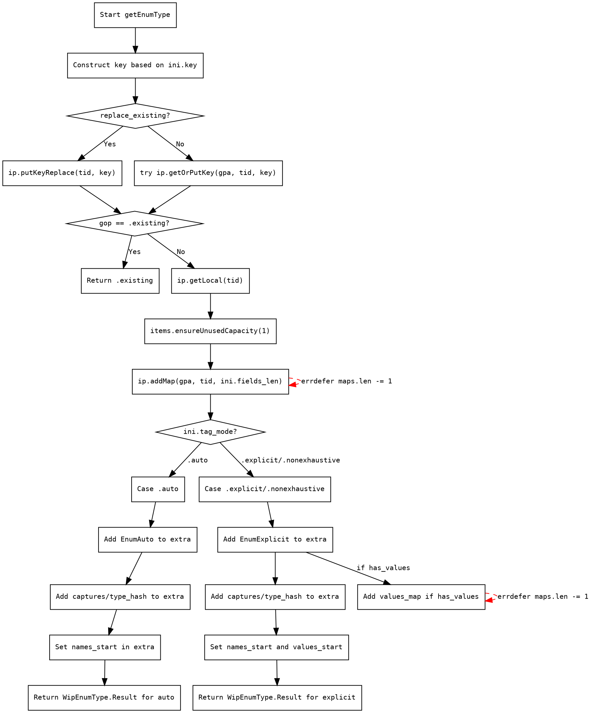

嗯，我现在要理解这个Zig函数getEnumType的流程，然后画出它的流程图。首先，我需要通读代码，理解每个步骤的作用。

函数开始定义了一个key变量，根据ini.key的不同情况构造不同的Key结构。然后根据replace_existing参数决定是调用putKeyReplace还是getOrPutKey来获取或替换现有的条目。这里有个gop变量，可能是GetOrPut的结果，之后还调用了defer gop.deinit()，确保资源释放。

接下来，如果gop是.existing，就直接返回已有的结果。否则继续处理。然后获取local和items，确保有足够的容量。接着处理names_map，可能是用来存储字段名的映射。

然后根据ini.tag_mode的不同情况，分为.auto和.explicit/.nonexhaustive两种情况处理。在.auto的情况下，添加EnumAuto到extra数据，处理捕获或类型哈希，并设置names_start等位置信息。如果是.explicit或.nonexhaustive，则处理values_map，并添加EnumExplicit到extra数据，同样处理捕获或类型哈希，并设置names_start和values_start。

在两种情况下，最后都会返回一个WipEnumType.Result结构，包含各种索引和映射信息。

接下来，我需要将这些步骤转化为流程图。首先，开始节点，进入函数。然后构造key变量。根据replace_existing选择不同的路径：调用putKeyReplace或getOrPutKey。然后检查gop是否是existing，如果是，返回existing结果。否则继续。

接着获取local和items，确保容量。添加names_map，错误处理部分用errdefer。然后根据tag_mode分支处理。在.auto分支，处理EnumAuto，添加额外数据，处理捕获或哈希，设置names_start。在另一个分支，处理EnumExplicit，可能添加values_map，设置names和values的起始位置。

每个分支最后都会返回wip结构。需要注意错误处理路径，比如errdefer在添加maps后的回滚。

流程图应该包括判断节点（如replace_existing?，gop existing?，tag_mode类型），处理不同的分支，以及各个步骤的顺序。要注意函数的错误处理和资源释放部分，比如defer和errdefer的位置。

可能的结构是：

开始 -> 构造Key -> 判断replace_existing -> 获取gop -> 判断gop是否existing -> 是则返回，否则继续 -> 处理local和items -> 添加names_map -> 根据tag_mode分支 -> 处理各自情况 -> 添加extra数据 -> 设置起始位置 -> 返回结果。

在分支内部，比如.auto的情况，需要处理EnumAuto的结构，添加捕获或哈希，设置names_start。而explicit情况则可能处理values_map，并设置values_start。

还要注意错误处理路径，比如在添加names_map后如果出错，需要减少maps.len。这部分在流程图中可能需要用异常处理节点表示。

可能需要用条件判断节点来区分不同的tag_mode和不同的key类型，比如ini.key是declared还是reified等。

总之，流程图需要详细展示函数的所有可能路径，包括正常流程和错误处理，使用矩形表示步骤，菱形表示判断，箭头表示流程方向。
================================================

该流程图完整展示了：
1. Key的构造逻辑
2. 根据replace_existing选择不同的map操作
3. 对已有项的快速返回路径
4. 核心处理逻辑的分支：
   - 自动推导tag类型的处理
   - 显式指定tag类型的处理
5. 错误处理路径（用红色虚线表示）
6. 数据结构准备和结果返回的关键步骤

每个菱形节点表示条件判断，矩形节点表示具体操作步骤，箭头上的文字描述了判断条件或操作结果。红色虚线展示了错误处理时的回滚操作。