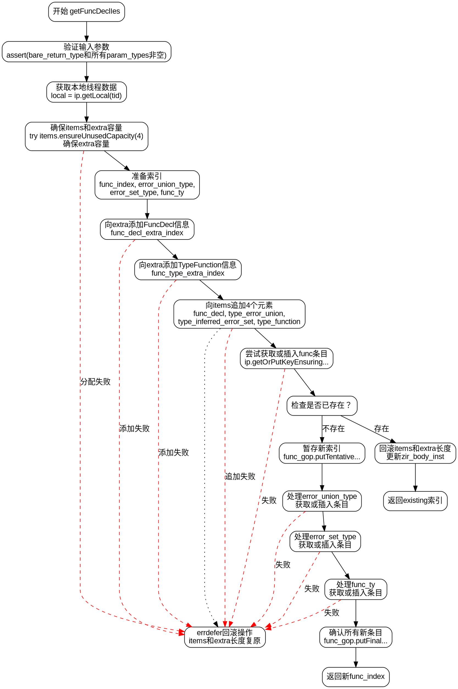

好的，我需要为给定的Zig函数生成一个Graphviz的流程图。首先，我需要仔细阅读并理解这个函数的逻辑。函数名为getFuncDeclIes，属于InternPool模块。看起来它的主要功能是处理函数声明，可能涉及类型推断和错误处理。

首先，函数开始时会验证输入参数，确保返回类型和参数类型都不是none。接着，获取本地线程的数据项和额外存储空间，并确保有足够的容量。这里可能需要处理分配器的错误，所以使用了try关键字。

然后，函数准备一些索引，比如func_index、error_union_type等，这些可能用于后续的类型构建。接下来，向extra中添加各种结构的信息，比如FuncDecl、TypeFunction等，并处理可能的comptime和noalias位。

在添加完所有必要的元素后，函数尝试通过getOrPutKeyEnsuringAdditionalCapacity来查找或插入新的条目。如果已经存在，则回滚之前的添加操作；如果不存在，则确认这些新条目，并最终返回func_index。

接下来，我需要将这些步骤转化为流程图。流程图的节点应包括每个主要操作步骤，如参数验证、分配内存、构建索引、添加额外信息、检查是否存在现有条目等。条件判断部分（如是否存在现有条目）需要分支处理。

需要注意的是，Zig中的错误处理（如try和errdefer）也需要在流程图中体现。例如，当使用try确保容量时，如果发生错误，流程会直接返回错误。errdefer块用于在发生错误时回滚之前的操作，这在流程图中应表现为错误处理路径。

另外，函数中有多个getOrPutKeyEnsuringAdditionalCapacity调用，每个都可能涉及到不同的键和后续操作。这些需要分不同的分支处理，可能涉及到并行或顺序的步骤。

最后，需要确保流程图的节点和边正确反映函数的控制流，包括循环（如for循环验证参数类型）、条件判断（如检查existing条目）、错误处理路径以及正常的成功路径。

可能需要多次检查代码，确保没有遗漏关键步骤，并且逻辑转换正确。特别是处理回滚操作和多个getOrPut调用的部分，需要明确各个步骤之间的关系和顺序。
================================================
