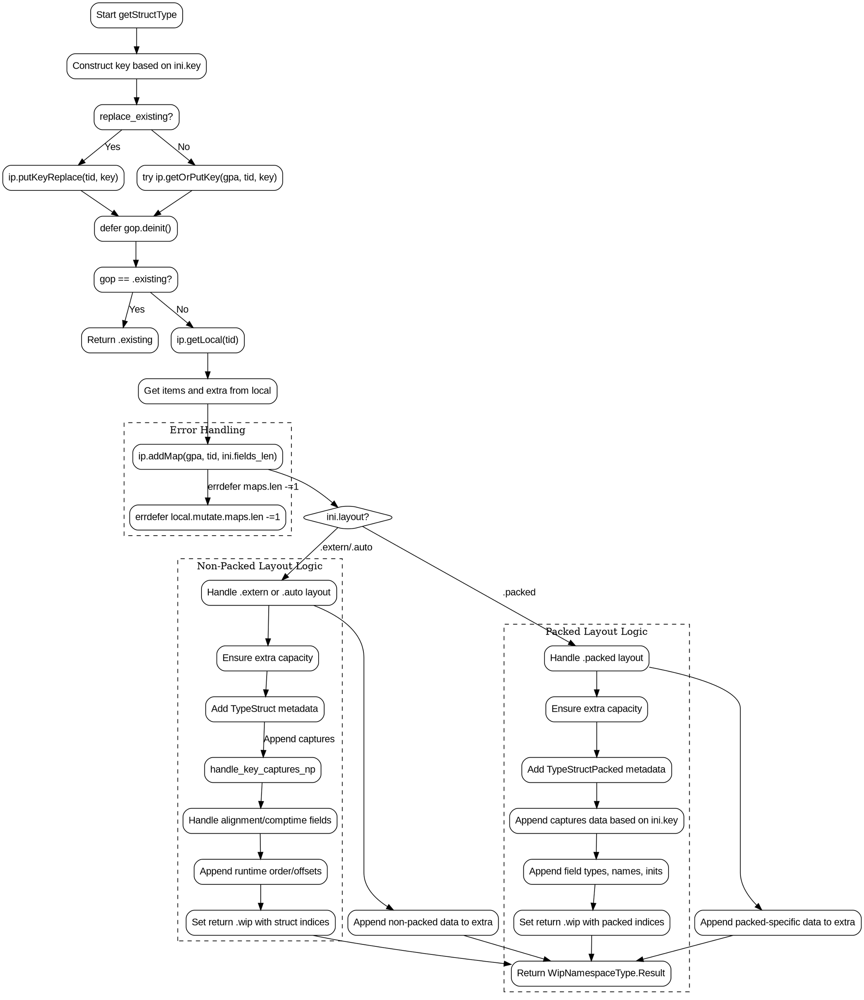

嗯，我需要为这个Zig函数生成一个Graphviz流程图。首先，我得仔细阅读代码，理解函数的结构和流程。这个函数叫getStructType，看起来是用来创建或获取结构类型的。参数包括InternPool、分配器、线程ID、结构类型初始化和一个替换标志。

首先，函数开始处定义了一个key变量，根据ini.key的不同情况来构造不同的Key类型。然后根据replace_existing参数决定是调用putKeyReplace还是getOrPutKey。这里可能会有两个分支，一个是替换现有的，另一个是获取或创建新的。

接下来，如果gop是existing，就直接返回existing结果。否则继续处理。然后获取local实例，并获取items和extra的可变引用。之后添加names_map，可能涉及到错误处理，所以有errdefer来确保在出错时回滚。

然后根据ini.layout的不同情况，分为packed和其他布局（如extern或auto）。如果是packed布局，处理逻辑比较复杂，需要添加额外的数据结构，处理捕获、字段类型、名称、初始化等。这里可能会有多个步骤，比如确保extra容量，添加结构体类型的元数据，处理不同的key情况，以及填充字段信息。

如果是非packed的情况（比如extern或auto），同样需要处理类似的步骤，但具体的数据结构可能不同，比如处理对齐、编译时字段等。这里会再次根据ini.key的不同情况处理捕获，填充extra数据，包括字段类型、名称、初始化、对齐元素、运行时顺序等。

最后，无论是哪种布局，都会返回一个WipNamespaceType.Result，其中包含tid、index和额外的索引信息。

在画流程图时，我需要把这些主要步骤和分支结构表示出来。开始于函数入口，然后处理key的构造，判断replace_existing来选择不同的gop操作。接着检查是否已有existing结果，如果有则直接返回，否则继续。然后处理不同的布局情况，packed和其他布局各自有不同的处理流程，里面包含各自的子步骤，如添加元数据、处理捕获、填充字段信息等。最后返回结果。

需要注意条件判断的分支，如switch (ini.layout)、switch (ini.key)等，这些在流程图中需要用条件节点来表示。同时，错误处理部分如errdefer也需要考虑进去，可能需要回滚操作。此外，函数的返回路径有多个，需要正确连接各个分支的结束点到返回节点。

可能遇到的挑战是正确捕捉所有条件分支和循环结构，确保流程图中的每个判断点都有正确的出口。此外，代码中有许多细节步骤，需要合理分组，避免流程图过于复杂。可能需要将一些重复的步骤抽象为子流程，或者在图中合并相似的步骤，以保持清晰。

总之，我需要将代码分解为主要的逻辑块，识别出所有的条件分支，处理错误路径，并将这些元素用Graphviz的节点和边连接起来，形成准确的流程图。
================================================
