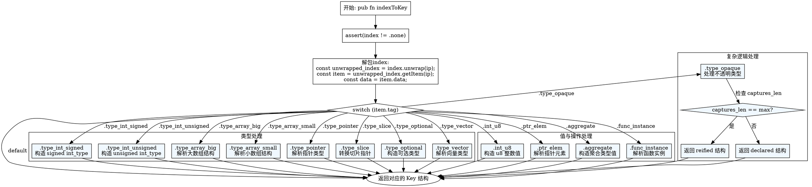

嗯，我现在需要帮用户画一个用Graphviz表示的流程图，针对他们提供的Zig代码中的`indexToKey`函数。首先，我需要理解这个函数的结构和工作流程。

这个函数看起来是一个大型的switch语句，根据不同的`item.tag`值返回不同的`Key`结构。每个case处理不同的类型或情况，比如整数类型、数组、指针、结构体等等。每个case中可能还会调用其他辅助函数，如`extraData`或者进行一些数据解包。

首先，我需要确定函数的主要流程。函数入口是`indexToKey`，首先进行断言检查，然后解包索引，获取对应的`item`和`data`。然后进入switch语句，每个case对应不同的处理逻辑。每个case结束后返回相应的Key结构。

接下来，我需要将这些逻辑步骤转化为流程图。流程图通常包括开始、结束节点、判断节点、处理步骤和连接线。由于这是一个大的switch语句，可能需要将每个case作为一个处理步骤，但考虑到可能有多个条件分支，可能需要使用判断节点来表示不同的tag分支。

但是，Graphviz的流程图通常更适合顺序和分支结构，而这里是一个多分支的switch，每个case独立处理。因此，可能需要将每个case作为一个独立的分支，从switch节点分出多个分支，每个分支处理对应的tag情况，然后指向相应的处理步骤，最后汇总到结束节点。

需要注意的是，有些case内部还有条件判断，比如`.type_opaque`中有if语句，这可能需要进一步的子流程图。但用户可能希望一个高层次的流程图，不需要深入到每个case的内部细节，否则流程图会过于复杂。

因此，我可能需要在主流程图中将每个case作为一个处理节点，而内部的复杂逻辑简化为一个步骤。如果用户需要更详细的子流程，可能需要单独处理，但根据问题描述，可能只需要主流程。

另外，需要确保不要使用Mermaid语法，而是用Graphviz的DOT语言。用户特别指出不要错误使用Mermaid，所以必须确认生成的是正确的DOT代码。

现在，开始设计流程图的结构：

1. 开始节点：函数开始，执行断言检查，解包index，获取item和data。
2. Switch节点：根据item.tag进入不同的分支。
3. 每个tag对应的处理分支，例如.type_int_signed、.type_array_big等，每个分支执行相应的操作并返回Key。
4. 结束节点：所有分支最终返回Key，结束函数。

由于tag非常多，可能需要将每个tag作为一个分支，但这样会导致流程图非常庞大。可能需要进行分组或合并，但用户可能希望每个tag都有对应的节点。或者，将switch作为一个菱形判断节点，分出多个分支，每个分支对应一个tag，然后处理并返回。

但Graphviz处理大量分支时可能会显得拥挤，所以需要合理安排结构，可能使用子图（subgraph）来组织不同的case，但DOT中的子图主要用于集群，不一定能改善布局。

另一个方法是，将整个switch作为一个大的判断节点，然后每个case作为一个处理节点，连接到该判断节点。但由于tag数量太多，可能需要垂直排列，使用rankdir=TB（从上到下）来布局。

可能的Graphviz结构如下：

digraph {
    node [shape=rectangle];
    start [label="开始: indexToKey"];
    assert [label="断言index != .none"];
    unwrap [label="解包index，获取item和data"];
    switch [label="switch(item.tag)", shape=diamond];
    end [label="返回Key", shape=ellipse];

    start -> assert -> unwrap -> switch;
    switch -> type_int_signed;
    switch -> type_int_unsigned;
    // ... 其他tag分支
    type_int_signed -> process_int_signed -> end;
    type_int_unsigned -> process_int_unsigned -> end;
    // 每个处理节点连接到end
    // 更多节点...
}

但这样每个case都要单独列出，导致节点数量爆炸。可能需要简化，比如用一个节点表示所有case处理，但这样不够详细。

或者，用一个大的switch节点，然后每个case直接连接到返回Key的节点，中间的处理步骤合并为一个节点。

例如：

digraph {
    rankdir=TB;
    start [label="开始"];
    assert [label="assert(index != .none)"];
    unwrap [label="const unwrapped_index = index.unwrap(ip);\nconst item = unwrapped_index.getItem(ip);\nconst data = item.data;"];
    switch [label="switch (item.tag)", shape=diamond];
    end [label="返回对应的Key结构", shape=ellipse];

    start -> assert -> unwrap -> switch;
    switch -> case_type_int_signed [label=".type_int_signed"];
    switch -> case_type_int_unsigned [label=".type_int_unsigned"];
    // ... 其他case
    case_type_int_signed [label="构造int_type signed"];
    case_type_int_unsigned [label="构造int_type unsigned"];
    // 每个case节点连接到end
    case_type_int_signed -> end;
    case_type_int_unsigned -> end;
    // 其他case同理
}

这样每个case作为一个处理节点，直接从switch分支出去，处理完后到结束节点。这样结构清晰，但节点数量多。可能需要调整布局，避免交叉线过多。

此外，有些case内部还有条件判断，比如`.type_opaque`中的if语句，这时候可能需要为这些case添加子流程。例如：

case_type_opaque [label="处理.type_opaque"];
case_type_opaque -> if_captures_len [label="检查captures_len"];
if_captures_len [label="captures_len == maxInt(u32)?", shape=diamond];
if_captures_len -> reified [label="是"];
if_captures_len -> declared [label="否"];
reified [label="返回reified结构"];
declared [label="返回declared结构"];
reified -> end;
declared -> end;

但这样会使流程图更加复杂。用户是否希望包含这些细节？根据问题描述，用户可能希望主流程图，每个case作为一个处理步骤，而内部的条件分支可能不需要展开，除非特别重要。

综上所述，主流程图应包含开始、断言、解包、switch分支，每个tag对应一个处理节点，然后结束。对于内部有条件的情况，可能在节点标签中简要说明，比如在节点描述里写上“根据captures_len选择结构”。

现在，编写Graphviz的DOT代码，尽量覆盖所有case，但可能由于数量太多，需要适当简化或用注释表示。但用户可能需要尽可能详细的流程图，所以需要列出所有case。

但由于代码中的case非常多，可能超过50个，手动编写每个节点会非常繁琐。可能需要寻找模式，比如每个case的处理可以归纳为返回特定结构，因此可以将节点标签简化为tag名称和返回的Key类型。

例如：

case_type_int_signed [label=".type_int_signed\n返回int_type signed"];
case_type_int_unsigned [label=".type_int_unsigned\n返回int_type unsigned"];

这样可以减少节点文字量，同时保持信息完整。

最后，生成的DOT代码需要包含所有case分支，每个分支连接到结束节点。这可能使图形非常长，但这是用户需要的详细流程图。
================================================

### 流程图说明：
1. **层级结构**：使用 `rankdir=TB` 从上到下布局，主流程为 `开始 -> 断言 -> 解包 -> switch`。
2. **分类分组**：用 `subgraph` 将不同类型的处理逻辑分组（如类型处理、值处理、复杂逻辑）。
3. **节点标注**：每个 case 节点标注对应的 `.tag` 名称和简要操作（如 `.type_int_signed` 对应构造 signed int_type）。
4. **复杂逻辑展开**：对包含子判断的 case（如 `.type_opaque`），用嵌套的菱形节点表示条件分支。
5. **统一终点**：所有分支最终指向 `返回对应的 Key 结构` 节点，表示函数出口。

> 注：由于实际代码中 case 数量较多，此图仅展示部分代表性分支。完整流程图需按相同模式补充所有 tag 的分支逻辑。