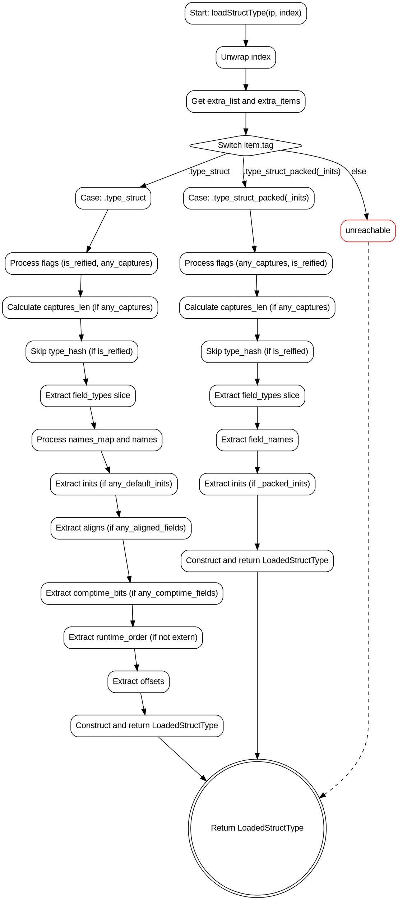

嗯，用户让我用Graphviz来画这个Zig函数的流程图。首先，我需要理解这个函数的结构。函数是`loadStructType`，接受一个`InternPool`指针和一个`Index`，返回`LoadedStructType`。看起来这个函数主要是根据不同的结构体类型标签（如`.type_struct`、`.type_struct_packed`等）来加载不同的结构体信息。

首先，函数开始处解包了`index`，获取了`extra_list`和`extra_items`。然后根据`item.tag`进行switch判断。主要的两个分支是`.type_struct`和`.type_struct_packed`（包括`.type_struct_packed_inits`）。每个分支内部分别处理不同的字段，比如名称、命名空间、字段数量、标志位等，然后构建并返回`LoadedStructType`结构体。

接下来，我需要将这个过程转化为流程图。流程图应该从函数入口开始，然后根据不同的tag分支处理。每个分支内部有很多步骤，比如读取extra数据、处理flags、计算字段偏移等。这些步骤需要作为节点，并用箭头连接起来。

需要注意的是，Graphviz使用DOT语言，我需要定义各个节点和它们之间的连接。例如，函数入口后首先解包index，然后进入switch，根据tag分到不同的分支。每个分支内部可能有多个操作步骤，比如处理flags、计算captures_len、处理field_types等。最后，每个分支都会构造并返回LoadedStructType。

可能遇到的挑战是如何组织大量的步骤节点，避免图形过于复杂。可能需要将每个分支的主要步骤作为子图，或者适当合并一些步骤。另外，需要注意条件判断，如`if (flags.any_captures)`这样的条件，应该在流程图中用菱形判断节点表示。

此外，代码中有多个条件判断，比如`if (flags.any_captures)`、`if (flags.is_reified)`等，这些在流程图中需要用条件分支来表示。因此，每个条件判断需要生成一个判断节点，然后根据条件结果分到不同的处理流程。

最后，确保所有路径最终都会构造并返回`LoadedStructType`，并且处理异常情况（如`unreachable`）可能需要单独标注。

现在，我需要将这些思考转化为具体的Graphviz DOT代码，合理组织节点和边，确保逻辑清晰，结构合理。
================================================

该流程图使用以下约定：  
- 菱形节点表示条件分支  
- 红色节点表示不可达代码路径  
- 虚线边表示异常流程  
- 主要分支用不同颜色区分（可在实际渲染工具中配置）  
- 省略了部分详细字段处理步骤以保持可读性  
- 每个分支最终汇聚到统一的返回节点