嗯，我需要为这个Zig函数`typeOf`画一个流程图。首先，我得仔细看看这个函数的结构。函数里有一个大的switch语句，处理不同的index情况，然后根据不同的分支返回对应的类型。

首先，函数开始于`pub fn typeOf(ip: *const InternPool, index: Index) Index`。然后进入switch (index)，处理各种情况。第一个分支是列举了很多type的常量，比如.u0_type, .i0_type等等，这些情况都返回.type_type。接着是一些特定的值，比如.undef返回.undefined_type，.zero、.one等返回.comptime_int_type。之后是.default分支，处理其他情况，这里又有一个内部的switch，根据item.tag的不同进行处理，比如.type_int_signed、.type_int_unsigned等返回.type_type，还有一些其他的tag返回不同的类型，或者通过访问extra数据来获取类型。

接下来，我需要把这些逻辑转化为流程图。流程图应该从函数入口开始，然后根据不同的条件分支展开。首先判断index是否属于预定义的静态类型，如果是，直接返回.type_type。如果不是，进入默认分支，处理更复杂的情况，包括检查item.tag，处理不同的tag情况，可能访问extra数据或者limbs数据来获取类型。

需要注意的是，有些分支会导致直接返回，而有些则需要进一步的处理。例如，当item.tag是.int_positive或.int_negative时，需要从limbs数据中获取Int结构并返回其类型。而像.enum_literal则直接返回.enum_literal_type。

可能遇到的难点是如何正确表示嵌套的switch结构，尤其是默认分支内部的switch(item.tag)。需要确保每个可能的路径都被正确表示，并且流程图的箭头指向正确的返回结果。另外，确保所有可能的tag情况都被覆盖，避免遗漏导致流程图不完整。

最后，使用Graphviz的DOT语言来绘制流程图，确保节点和边的正确连接，使用菱形表示条件判断，矩形表示处理步骤，椭圆表示开始和结束点。
================================================

```dot
digraph flowchart {
    node [shape=ellipse] start end;
    node [shape=diamond] condition;
    node [shape=rectangle] process;

    start -> condition_index [label="typeOf(ip, index)"];
    
    subgraph cluster_switch_index {
        label="switch(index)";
        
        condition_index [label="index matches predefined types?"];
        condition_index -> return_type_type [label="Yes (e.g., .u0_type, .i0_type)"];
        condition_index -> handle_static_values [label="Specific values (e.g., .undef, .zero)"];
        condition_index -> default_case [label="Default"];
        
        return_type_type [label="return .type_type"];
        handle_static_values [label="Handle static values (e.g., .undef → .undefined_type)"];
        handle_static_values -> end;
    }

    handle_static_values -> return_static_type [label="Direct mapping"];
    return_static_type [label="Return corresponding type (e.g., .undefined_type)"];

    subgraph cluster_default_case {
        label="Default case";
        
        default_case -> unwrap_index [label="index.unwrap(ip)"];
        unwrap_index -> get_item [label="getItem(ip)"];
        get_item -> condition_tag [label="switch(item.tag)"];
        
        condition_tag [label="item.tag"];
        condition_tag -> return_via_enum [label=".undef/.opt_null/..."];
        condition_tag -> handle_pointer_types [label=".ptr_*/..."];
        condition_tag -> handle_int_types [label=".int_*/..."];
        condition_tag -> handle_float_types [label=".float_*/..."];
        condition_tag -> handle_others [label="Others"];
        
        return_via_enum [label="Return @enumFromInt(item.data)"];
        handle_pointer_types [label="Access extra data → return type"];
        handle_int_types [label="Check int type (e.g., .int_u8 → .u8_type)"];
        handle_float_types [label="Check float type (e.g., .float_f16 → .f16_type)"];
        handle_others [label="Special cases (e.g., .enum_literal → .enum_literal_type)"];
    }

    return_type_type -> end;
    return_static_type -> end;
    return_via_enum -> end;
    handle_pointer_types -> end;
    handle_int_types -> end;
    handle_float_types -> end;
    handle_others -> end;

    start [label="Start"];
    end [label="End"];
}
```
