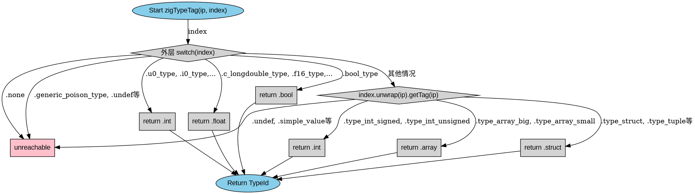

好的，我需要为给定的Zig函数`zigTypeTag`绘制一个流程图。首先，我需要理解这个函数的结构和逻辑。

函数`zigTypeTag`接受一个`InternPool`的指针和一个`Index`类型的参数，返回一个`std.builtin.TypeId`。函数的主体是一个大的switch语句，根据不同的`index`值返回不同的类型标签。

首先，我会分析switch语句的分支结构。最外层的switch处理`index`的不同情况，比如`.u0_type`、`.i0_type`等，这些直接返回对应的类型，如`.int`、`.float`等。然后，当`index`匹配到某些特定值时，比如`.generic_poison_type`或`.undef`，会触发`unreachable`，表示这些情况不应该发生。

接下来是默认分支，当外层switch没有匹配时，会进入`index.unwrap(ip).getTag(ip)`的内部switch。这里根据不同的标签返回对应的类型，比如`.type_int_signed`对应`.int`，`.type_array_big`对应`.array`等。同样，某些标签会导致`unreachable`，表示无效情况。

最后，有一个`.none`的分支，也触发`unreachable`。

为了绘制流程图，我需要将每个switch分支转化为流程图的节点和判断框。可能的步骤如下：

1. **开始节点**：函数开始。
2. **判断index的值**：第一个switch语句作为多个判断分支。
3. **直接返回的情况**：如`.u0_type`返回`.int`，这些作为终止节点。
4. **处理内部switch**：当外层不匹配时，进入内部switch，同样进行判断并返回或触发错误。
5. **错误处理**：`unreachable`作为错误节点。
6. **结束节点**：所有路径最终结束。

需要注意，由于存在多层switch结构，流程图可能会有多个层次。需要确保每个分支正确连接到对应的处理流程，特别是外层不匹配时进入内部判断的部分。

另外，要使用Graphviz的语法，正确使用节点和边的定义，避免使用Mermaid。可能需要使用子图来组织内部switch的结构，或者用不同的形状表示判断和操作节点。

最后，检查是否有遗漏的分支或错误连接，确保流程图准确反映代码逻辑。
================================================
