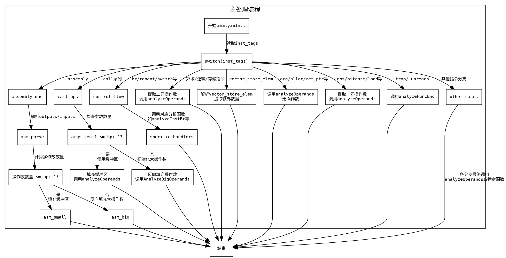

好的，我需要为提供的Zig函数`analyzeInst`绘制一个流程图。首先，我需要仔细阅读并理解这个函数的结构和逻辑。这个函数是一个大型的switch语句，根据不同的指令类型执行不同的操作。每个case处理不同的指令，调用不同的函数如`analyzeOperands`或`analyzeFuncEnd`，或者处理特定的指令结构。

首先，我需要确定函数的主要分支。函数的主体是一个大的switch语句，根据`inst_tags`的值进入不同的case。每个case对应一种指令类型，处理方式各不相同。例如，有些case直接调用`analyzeOperands`，有些处理额外的数据，还有些可能递归调用其他分析函数如`analyzeInstBr`或`analyzeInstCondBr`。

接下来，我需要考虑如何将这些复杂的逻辑转化为流程图的结构。流程图应该从函数入口开始，然后根据不同的指令类型分支出不同的处理路径。每个分支可能包含多个步骤，比如获取数据、处理操作数、调用其他函数等。需要注意的是，某些case内部还有条件判断，例如`.call`指令处理时根据参数数量是否超过某个阈值（bpi-1）进入不同的处理流程。

还需要处理一些特殊情况，比如`.assembly`指令需要处理多个输出和输入操作数，可能需要使用大操作数处理流程。此外，像`.aggregate_init`这样的指令会根据数组长度决定是否使用缓冲区或者大操作数处理。

在绘制流程图时，应该为每个主要的case创建一个节点，描述该case的主要操作，并用箭头表示流程的走向。对于包含条件判断的分支，需要添加判断节点，如“参数数量是否超过bpi-1？”并根据判断结果分叉。

另外，函数中有一些通用的处理模式，例如调用`analyzeOperands`时传递不同数量的操作数，这些可以抽象为子流程，但为了简化流程图，可能直接在节点中描述关键参数。

需要注意避免过于详细的节点，保持流程图的可读性。可能需要将一些复杂的处理步骤合并为一个节点，例如将多个操作数处理合并为一个步骤，而不是每个操作数单独处理。

最后，确保流程图的正确性，每个分支和条件都要准确反映代码的逻辑。可能需要多次检查代码逻辑，确保没有遗漏重要的分支或处理步骤。
================================================
