好的，我需要为这个Zig函数`categorizeOperand`绘制一个流程图。首先，我得理解这个函数的结构和逻辑。看起来这是一个处理不同指令类型并根据操作数返回相应类别的函数。函数主体有一个大的switch语句，根据不同的指令类型执行不同的操作。

首先，我会列出主要的switch分支。每个分支处理不同的指令类型，比如.add、.sub、.store、.call等。每个分支可能有不同的逻辑来决定操作数的类别。例如，对于二元操作，会检查lhs和rhs是否为当前操作数，并返回相应的类别。对于存储类指令，可能标记为写操作。

接下来，我需要确定流程图的结构。通常，流程图开始于函数入口，然后根据不同的条件分支展开。每个switch分支可以作为一个决策节点，根据不同的指令类型进入不同的处理流程。处理完毕后，每个分支会返回相应的OperandCategory，如.none、.write、.tomb等。

需要注意的是，有些分支可能包含嵌套的条件判断，比如.call指令中有循环检查参数，或者.block中处理基本块体的情况。这些复杂的情况可能需要更多的子流程来表示。

另外，函数中有一些重复的模式，比如检查操作数是否为lhs或rhs，然后调用matchOperandSmallIndex。这些可以抽象为共同的步骤，但在流程图中可能需要分别表示每个条件判断。

由于函数较长且分支众多，流程图可能会非常庞大。因此，我需要合理组织结构，使用子流程图或分组来避免过于复杂。例如，可以将主要的switch分支作为顶层节点，每个分支下的处理逻辑作为子节点展开。

最后，确保流程图的正确性，每个条件判断和返回路径都要准确反映代码的逻辑。可能需要多次检查各个分支的处理步骤，确保没有遗漏或错误。
================================================

```dot
digraph flowchart {
    graph [rankdir=TB, fontname="Courier", fontsize=12];
    node [shape=rectangle, fontname="Courier", fontsize=10, style=filled, fillcolor=lightgray];
    edge [fontname="Courier", fontsize=10];

    start [label="categorizeOperand开始", shape=oval, fillcolor=skyblue];
    switch_inst [label="根据air_tags[inst]进行switch判断", shape=diamond, fillcolor=lightyellow];
    bin_ops [label="处理二元操作（add/sub/mul等）\n检查lhs/rhs是否为operand_ref", fillcolor=white];
    store_ops [label="处理存储类指令（store/atomic_store等）\n标记为.write", fillcolor=white];
    vector_store_elem [label="处理vector_store_elem\n检查vector_ptr和额外操作数", fillcolor=white];
    arg_alloc_etc [label="处理arg/alloc等简单指令\n直接返回.none", fillcolor=white];
    ty_op_unary [label="处理一元操作（not/bitcast等）\n检查ty_op.operand", fillcolor=white];
    ret_ops [label="处理ret/ret_safe等\n标记.noret", fillcolor=white];
    call_ops [label="处理call指令\n遍历参数并处理大tombstone", fillcolor=white];
    block_peephole [label="处理block/dbg_inline_block\n进行条件分支优化检查", fillcolor=white];
    complex_ops [label="复杂指令（try/loop/cond_br等）\n直接返回.complex", fillcolor=white];
    end [label="返回对应OperandCategory", shape=oval, fillcolor=skyblue];

    start -> switch_inst;
    switch_inst -> bin_ops [label="二元运算指令"];
    switch_inst -> store_ops [label="存储类指令"];
    switch_inst -> vector_store_elem [label="vector_store_elem"];
    switch_inst -> arg_alloc_etc [label="arg/alloc等"];
    switch_inst -> ty_op_unary [label="一元操作"];
    switch_inst -> ret_ops [label="ret指令"];
    switch_inst -> call_ops [label="call指令"];
    switch_inst -> block_peephole [label="block/dbg_inline_block"];
    switch_inst -> complex_ops [label="复杂控制流指令"];

    bin_ops -> end [label="返回.none或match结果"];
    store_ops -> end [label="返回.write或match结果"];
    vector_store_elem -> end [label="返回.write或match结果"];
    arg_alloc_etc -> end [label="返回.none"];
    ty_op_unary -> end [label="返回.none或match结果"];
    ret_ops -> end [label="返回.noret"];
    call_ops -> end [label="返回.write/.tomb"];
    block_peephole -> end [label="返回.complex/.tomb/.none"];
    complex_ops -> end [label="返回.complex"];
}
```
