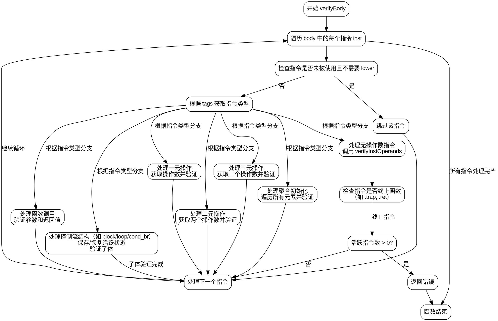

嗯，我需要为给定的Zig函数`verifyBody`绘制一个流程图。首先，我需要理解这个函数的结构和工作流程。函数的主要目的是验证某种中间表示（可能是编译器中的IR）的各个指令的活跃性（liveness）。函数接收一个`body`参数，遍历其中的每个指令，并根据不同的指令类型执行不同的验证操作。

首先，函数开始处获取了一些内部数据，比如`ip`（intern pool）、`tags`和`data`。然后进入一个循环，遍历`body`中的每个指令`inst`。对于每个指令，首先检查该指令是否未被使用且不需要被lower，如果是则跳过。接着根据指令的类型（通过`tags`数组获取）进行不同的处理。

接下来，我需要分析每个`switch`分支的处理逻辑。不同的指令类型（如`.arg`、`.alloc`等无操作数指令，`.not`、`.bitcast`等一元操作指令，二元操作、三元操作等）会调用`verifyInstOperands`方法，并传递相应的操作数。有些指令（如`.trap`、`.unreach`、`.ret`等）在验证操作数后，还会检查活跃指令数是否为0，否则报错。

还有一些复杂的控制流结构，比如`.block`、`.loop`、`.cond_br`、`.switch_br`等，这些结构需要处理基本块的活跃性，可能需要克隆当前活跃状态，验证子体的指令，然后恢复或合并活跃性信息。

为了绘制流程图，我需要将整个函数的控制流分解成各个步骤，并用节点表示每个步骤，边表示流程走向。可能的步骤包括：

1. 函数开始，初始化变量。
2. 遍历每个指令`inst`。
3. 检查指令是否未被使用且不需要lower，如果是则跳过。
4. 根据指令类型进入不同的处理分支。
5. 处理无操作数指令，调用`verifyInstOperands`，检查是否终止函数。
6. 处理一元操作，获取操作数并验证。
7. 处理二元操作，获取两个操作数并验证。
8. 处理三元操作，获取三个操作数并验证。
9. 处理聚合初始化、函数调用、汇编指令等需要处理多个操作数的情况。
10. 处理控制流结构（如条件分支、循环、块等），保存当前活跃状态，验证子体，恢复或合并状态。
11. 在每个分支处理完毕后，继续循环处理下一个指令。
12. 循环结束后，函数结束。

需要注意的是，处理控制流结构时，可能会涉及到递归调用`verifyBody`来处理子体（如`then_body`、`else_body`、`loop_body`等），这在流程图中需要以子流程或子图的形式表示。

另外，函数中有多个可能返回错误的地方，比如在检查活跃指令数不为零时返回错误，这些错误处理也需要在流程图中体现。

现在，我需要将这些步骤组织成一个结构化的流程图，使用Graphviz的DOT语言来表示。需要确定各个节点之间的关系，处理条件分支和循环结构，以及错误处理路径。

可能的节点包括：

- 开始节点
- 循环遍历每个指令
- 检查指令是否跳过
- 根据指令类型选择分支
- 各个指令类型的处理块
- 调用`verifyInstOperands`
- 检查活跃指令数是否为0
- 处理控制流结构（如条件分支、循环等）
- 错误处理节点
- 结束节点

边需要连接这些节点，表示程序执行的顺序和条件分支。例如，在检查指令是否需要跳过时，如果是则跳到下一个指令；否则进入对应的指令处理分支。处理完每个指令后，继续循环处理下一个指令，直到所有指令处理完毕。

对于复杂的控制流结构，如`.cond_br`，可能需要子流程来处理`then_body`和`else_body`，这些子流程也会调用`verifyBody`，可能需要递归处理，但在流程图中可以简化为一个节点，表示处理子体并合并活跃状态。

最后，需要确保所有的错误路径都指向错误节点，而正常流程则继续执行直到结束。
================================================
