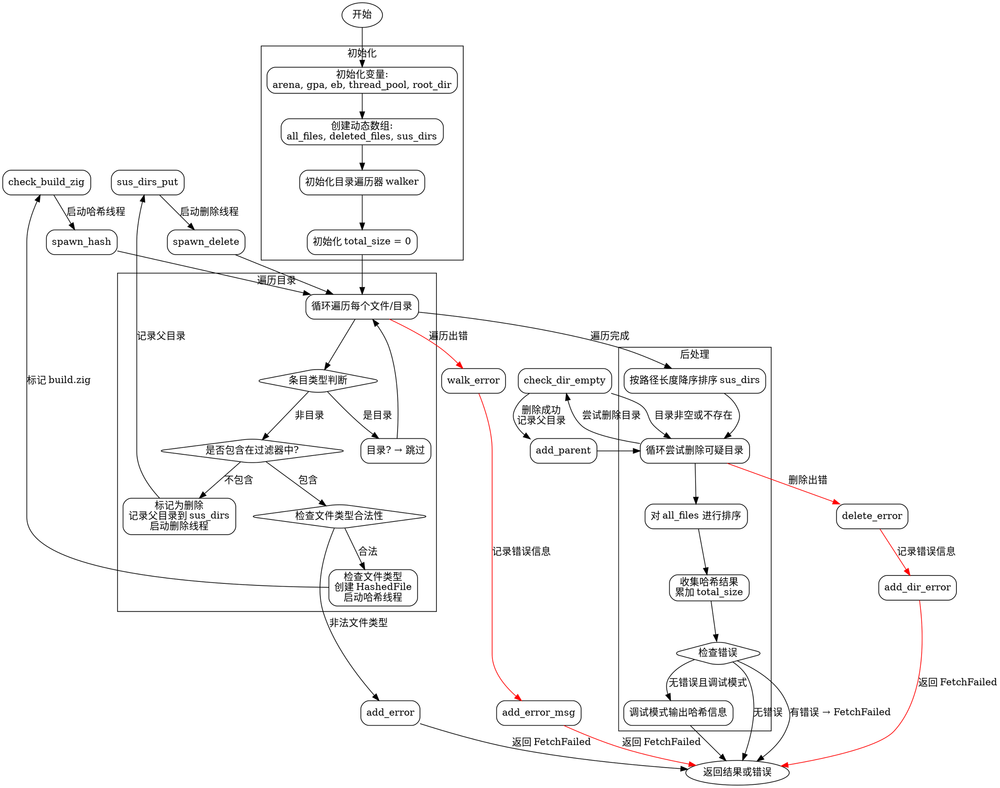

嗯，我现在需要为这个用Zig写的函数画一个流程图。首先，我得先理解这个函数的结构和逻辑。这个函数叫做computeHash，属于Fetch结构体的方法。它的主要功能是计算包的哈希值，处理文件过滤、删除不需要的文件，并收集所有需要哈希的文件，然后并行处理这些文件，最后生成哈希摘要和总大小。

首先，函数开始的时候，初始化了一些变量，比如arena、gpa、eb、thread_pool、root_dir等。然后创建了两个动态数组all_files和deleted_files，用来存储需要哈希的文件和被删除的文件。还有一个sus_dirs的哈希映射，用来跟踪可能需要删除的目录。

接下来，使用walker遍历根目录下的所有文件。对于每个条目，如果是目录就跳过；如果不是，检查是否需要包含在哈希计算中。如果不需要，就标记为删除，并记录其父目录到sus_dirs中。如果需要包含，则根据文件类型创建HashedFile对象，并启动线程池中的工作线程来处理哈希计算或删除操作。

在处理完所有文件后，对sus_dirs中的目录进行排序，按路径长度降序排列，这样可以先处理子目录。然后尝试删除这些目录，如果删除失败则处理错误。之后对all_files中的文件进行排序，使用HashedFile的比较函数。

然后，创建一个哈希器，遍历所有已处理的文件，收集哈希值，累加总大小。如果在处理过程中有任何错误，就收集错误信息，并返回失败。最后，如果开启了调试模式，就输出哈希信息。

现在，我需要把这些步骤转化为流程图。流程图应该包括开始、各个处理步骤、条件判断、循环、并行处理、错误处理以及结束部分。需要注意的是并行处理的部分，比如线程池中的workerHashFile和workerDeleteFile，这些可能需要用并发的符号表示。此外，错误处理需要在各个可能出错的地方添加判断和错误收集。

可能需要用到的图形符号包括：开始/结束的椭圆，处理步骤的矩形，条件判断的菱形，循环的箭头，并行处理的并行线，以及错误处理的路径。需要确保每个步骤之间的逻辑正确，特别是循环遍历文件和目录的部分，以及错误处理如何影响整个流程的走向。

需要注意的是，Graphviz使用的是DOT语言，所以需要将流程结构转化为节点和边的形式。每个主要的处理步骤作为一个节点，条件判断作为分支，循环可能需要用边连接回到之前的节点。例如，walker.next()的循环需要表示为循环结构，直到遍历完所有条目。

另外，sus_dirs的处理部分有一个循环，逐个检查目录是否为空并尝试删除，这里需要表示循环的递增和可能的重新进入循环。同时，在排序和哈希计算后，如果有任何错误，流程会直接返回错误，否则继续到最终的哈希结果和总大小的返回。

最后，确保流程图的各个部分逻辑连贯，没有遗漏关键步骤，特别是错误处理的路径，例如当walker.next()出错时，如何收集错误信息并返回错误。
================================================


这个流程图用 Graphviz 的 DOT 语言描述，主要特点：

1. 使用子图划分逻辑模块（初始化/遍历/后处理）
2. 红色边表示错误处理路径
3. 菱形节点表示条件判断
4. 包含了并行处理逻辑（线程池启动）
5. 展示了目录遍历、文件过滤、哈希计算、错误收集等关键步骤
6. 最终合并所有错误检查并返回结果

可以通过 Graphviz 工具生成图片，例如使用命令：
```bash
dot -Tpng computeHash.dot -o computeHash.png
```