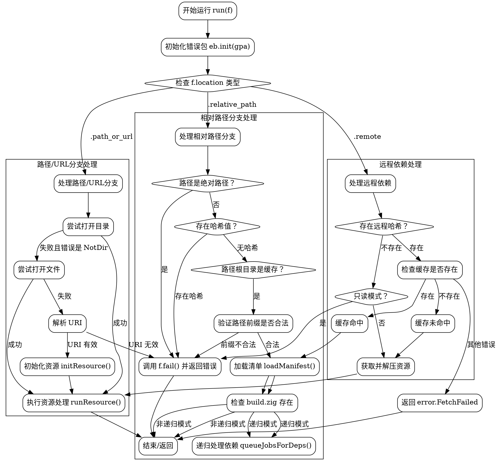

好的，我现在需要分析用户提供的Zig代码，并生成相应的Graphviz流程图。首先，我需要仔细阅读代码，理解其逻辑结构。代码是Zig语言编写的，函数名为`run`，属于`Fetch`结构体的方法。这个函数的主要功能是处理包的获取逻辑，包括检查本地缓存、处理远程或路径依赖等。

首先，函数开始初始化错误包（`eb.init(gpa)`），然后根据`f.location`的不同类型进行不同的处理。这里有三个可能的`switch`分支：`.relative_path`、`.remote`和`.path_or_url`。每个分支对应不同的处理逻辑。

对于`.relative_path`，函数检查路径是否为绝对路径，是否有哈希值，以及路径是否在项目目录内。如果路径有效，则加载清单文件，检查构建文件是否存在，如果不是递归模式则返回，否则继续处理依赖。

对于`.path_or_url`，尝试打开目录或文件，如果失败则解析为URI，初始化资源并运行。

对于`.remote`，处理远程依赖，检查哈希是否存在，若存在则检查缓存，若缓存命中则加载清单和处理依赖；否则继续获取资源。

接下来，我需要将这些逻辑转化为流程图。流程图应包含开始和结束节点，每个条件判断（如switch分支、if判断）作为决策节点，各个处理步骤作为过程节点，错误处理作为单独的分支。

需要注意，Graphviz使用DOT语言，节点用矩形表示过程，菱形表示判断，箭头表示流程方向。需要正确连接各个节点，确保逻辑正确。

可能的挑战在于正确捕捉所有条件分支和循环，比如错误处理部分可能有多个返回点，需要确保每个错误路径都有对应的节点和边。此外，代码中的递归调用或返回需要明确表示。

现在，我需要将上述分析转化为具体的Graphviz DOT代码，确保每个步骤和条件都被正确表示。例如：

- 开始节点指向初始化错误包。
- 初始化后进入`switch(f.location)`的三个分支。
- 每个分支内部的处理步骤，如路径检查、哈希验证等。
- 处理远程时的缓存检查，命中与否的不同路径。
- 错误处理节点连接到相应的失败情况。
- 最终返回或继续处理依赖的节点。

需要确保所有可能的执行路径都有对应的节点和边，避免遗漏。同时，合理组织子图，使得流程图清晰易读，避免交叉过多。
================================================
