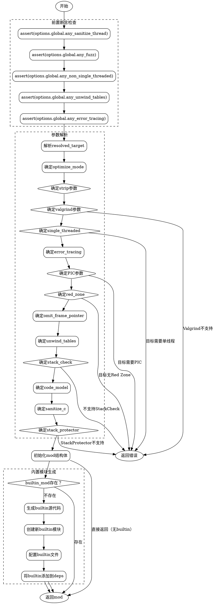

好的，我现在需要帮用户用Graphviz画出这个Zig函数的流程图。首先，我需要理解这个函数的结构和逻辑流程。这个函数是`create`，属于某个包或模块的一部分，主要功能是根据提供的选项创建并配置一个模块。

首先，函数开始处有一系列的断言检查，确保传入的选项符合全局设置的条件。例如，检查`sanitize_thread`、`fuzz`等选项是否满足全局的对应标志。这些断言是前置条件，应该在流程图中作为判断节点出现。

接下来，函数处理各种配置参数，比如`resolved_target`、`optimize_mode`、`strip`、`valgrind`等。这些处理大多使用条件表达式，根据不同的情况（如是否存在父模块、全局设置等）来决定最终的值。每个参数的处理都是一个分支逻辑，可能需要用条件判断节点来表示。

例如，处理`strip`参数时，首先检查`options.inherited.strip`是否存在，如果存在则使用它；否则检查是否有父模块，使用父模块的`strip`；最后使用全局的`root_strip`。这可以用一个条件判断的结构来表示。

处理`valgrind`时，首先检查目标平台是否支持Valgrind，如果不支持但选项启用了Valgrind，则返回错误。否则继续判断各个层级的设置。这同样需要多个条件分支。

之后，处理`single_threaded`时，根据目标平台是否总是单线程、是否支持线程、父模块设置等来决定。这里可能会有多个错误返回的情况，需要对应的错误处理节点。

接下来的参数处理类似，比如`error_tracing`、`pic`、`red_zone`、`omit_frame_pointer`等，每个参数的处理都涉及条件判断和可能的错误返回。

然后，函数进入模块的创建阶段，初始化`mod`结构体，并设置各个字段的值。这部分是顺序执行的步骤，没有分支，可以直接用流程节点表示。

接下来，处理`opt_builtin_mod`，这里可能生成内置模块。如果`builtin_mod`不存在，需要生成并配置它。生成过程中涉及哈希计算、文件创建等步骤，这部分逻辑较为复杂，可能需要多个子流程节点，包括生成源代码、创建文件、设置模块属性等。

最后，如果存在`opt_builtin_mod`，将其添加到模块的依赖中。这是最后一步，流程结束。

在绘制流程图时，需要注意以下几点：

1. **开始和结束节点**：函数开始和返回模块的地方作为流程的起点和终点。
2. **条件判断节点**：每个参数处理中的条件判断需要用菱形节点表示，并根据条件结果分支出不同的路径。
3. **错误处理**：当遇到错误时，直接返回错误，这些路径需要指向终止节点。
4. **并行处理**：可能存在多个参数处理的并行流程，但实际是顺序处理，需按代码顺序排列。
5. **子流程**：生成内置模块的部分可能作为一个子流程，可以用子图（subgraph）来组织，保持主流程的清晰。

需要注意的是，Graphviz的语法中，节点和边的定义是关键。每个处理步骤可以视为一个矩形节点，条件判断是菱形节点，错误返回用边连接到终止节点。由于函数较长，可能需要将流程图分成几个部分，或者使用子图来分组相关的逻辑块，避免过于拥挤。

另外，代码中有多个使用`break :b`的块，这些在流程图中应转换为对应的条件分支。例如，处理`strip`时的三个条件判断，对应三个可能的路径，每个路径最终赋值给`strip`变量。

在处理`llvm_cpu_features`时，涉及到循环遍历CPU特性，构建字符串。这部分可能需要简化为一个处理步骤，而不是详细展开循环，否则流程图会过于复杂。

生成内置模块的部分包含多个步骤，如生成源代码、计算哈希、创建文件、配置模块等。这部分可以作为一个子流程，包含多个步骤节点，并在主流程中引用这个子流程。

最后，确保所有可能的错误路径都连接到终止节点，而正常路径最终返回创建好的模块。

现在，我需要将这些逻辑步骤转化为Graphviz的节点和边，确保结构清晰，逻辑正确。可能需要多次调整布局，使用rankdir=TB（从上到下）来保持流程的连贯性，合理使用子图来组织复杂部分。
================================================
