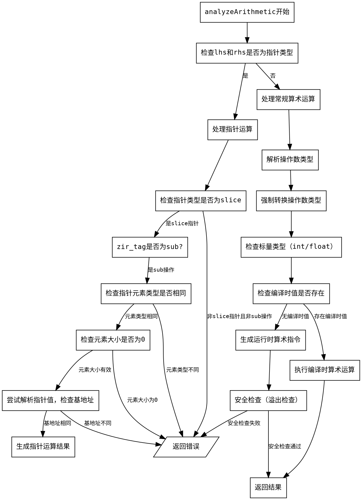

嗯，我需要为这个Zig函数`analyzeArithmetic`画一个流程图。首先，我得仔细读一遍代码，理解它的逻辑结构。这个函数处理算术运算的分析，包括指针运算、类型检查、安全验证等等。看起来有很多条件分支和错误处理。

首先，函数开始检查`lhs`和`rhs`的类型是否是指针。如果是，会处理指针运算的情况，比如减法或者加法。这里有几个条件分支，比如判断指针类型是否为slice，以及元素类型是否兼容。如果类型不匹配，会返回错误。

接着，如果不是指针类型，函数会尝试解析操作数的类型，并进行类型强制转换。然后根据操作数的类型（整数或浮点数）进行不同的处理。这里还有对编译时值的处理，比如检查是否有未定义的值，或者是否需要生成运行时操作。

在流程中，错误处理部分很多，比如使用`sema.fail`返回错误信息。同时，还有安全检查的部分，比如整数溢出检查，需要生成相应的安全指令或者panic。

我需要把这些逻辑分支用流程图的形式表示出来。可能需要从函数入口开始，逐步画出每个条件判断和处理步骤，包括错误返回和处理路径。每个条件判断对应不同的分支，比如指针类型判断、操作符类型判断、安全检查是否启用等。

需要注意循环结构可能不存在，但条件分支很多。比如，首先检查`lhs`是否为指针，如果是则进入指针处理分支，否则继续处理普通算术运算。每个分支内部可能还有嵌套的条件判断，比如指针类型是否为slice，是否需要检查元素大小等。

此外，错误处理路径需要明确标出，比如返回错误信息或生成安全代码。最后，函数返回操作结果或错误。

可能会用到菱形表示条件判断，矩形表示处理步骤，箭头表示流程走向。需要确保每个条件分支都有对应的出口，包括错误处理和正常流程。

可能还需要处理一些特殊情况，比如当元素大小为0时的错误，或者指针指向不同基地址时的处理。这些都需要在流程图中体现出来。

总之，流程图需要覆盖函数的所有主要逻辑路径，包括错误检查、类型处理、安全验证和结果生成。需要仔细梳理每个条件分支和对应的处理步骤，确保没有遗漏重要的逻辑点。
================================================


该流程图使用Graphviz的DOT语言描述，主要特点：

1. 使用菱形节点表示条件判断（如类型检查）
2. 矩形节点表示处理步骤
3. 平行四边形表示错误返回
4. 箭头标注具体条件判断结果
5. 分为指针运算和常规运算两大分支
6. 包含编译时值处理和运行时指令生成路径
7. 突出安全检查和错误处理逻辑

可以通过Graphviz工具（如dot命令）渲染生成矢量图，示例命令：
```bash
dot -Tpng sema_flow.dot -o sema_flow.png
```