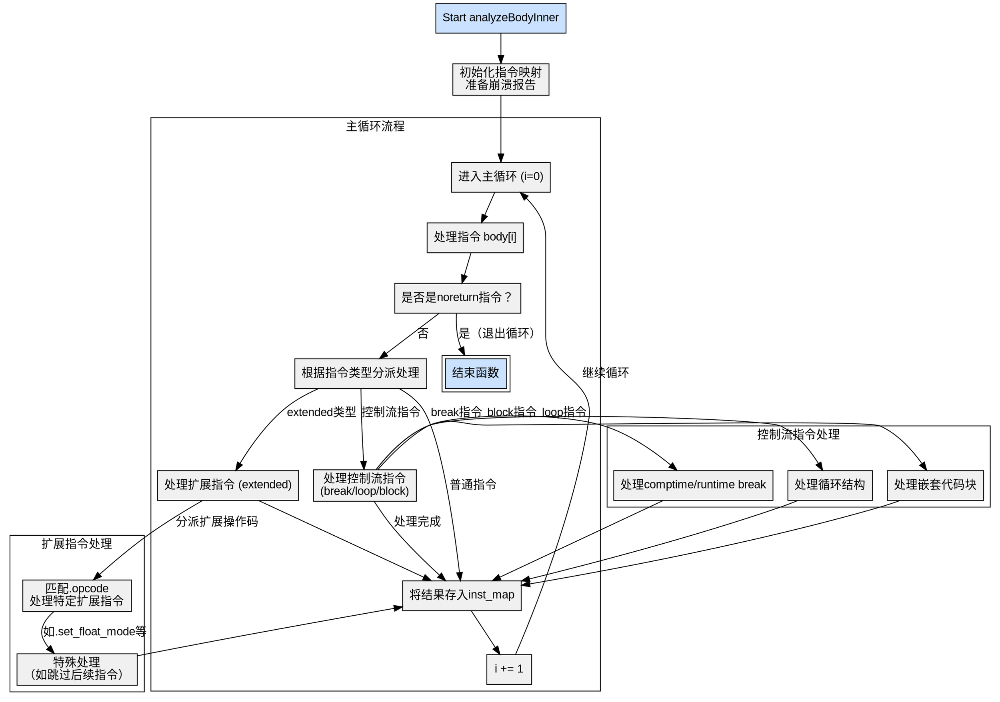

好的，我需要帮用户分析他们提供的Zig代码中的函数`analyzeBodyInner`，并用Graphviz画出流程图。首先，我需要理解这个函数的结构和逻辑流程。

这个函数看起来是一个语义分析函数，处理ZIR（Zig Intermediate Representation）指令。函数内部有一个大的while循环，遍历body中的每个指令，根据不同的指令标签调用相应的处理函数。还有一些条件分支和错误处理逻辑。

首先，我需要确定函数的主要流程：

1. **初始化部分**：确保指令映射有足够的空间，准备崩溃报告信息。
2. **主循环**：使用`while (true)`循环逐个处理指令。
3. **处理每个指令**：根据指令的标签（tag）跳转到不同的处理函数。
4. **特殊指令处理**：如遇到noreturn指令（如.compile_error, .ret_implicit等），则跳出循环。
5. **扩展指令处理**：处理扩展操作码（extended opcode）。
6. **控制流指令**：如break、loop、block等，处理不同的控制流。
7. **错误处理和资源清理**：使用defer确保资源释放，错误处理逻辑。

接下来，我需要将这些步骤转化为流程图中的节点和边。需要注意循环结构、条件分支以及可能的错误路径。

可能的节点包括：
- 初始化
- 进入循环
- 处理当前指令
- 根据指令类型分支到不同处理逻辑
- 处理扩展指令
- 处理控制流指令（如break、loop）
- 错误处理
- 循环继续或退出

边需要连接这些节点，表示程序执行的路径。例如，从“进入循环”到“处理当前指令”，然后根据指令类型分支到不同的处理节点，最后决定是否继续循环或退出。

需要注意处理特殊指令如noreturn，这些会导致直接退出循环。同时，扩展指令（extended）需要进一步分支到不同的处理函数。

此外，循环内部有多个continue和break的情况，需要正确表示这些控制流的跳转。

在绘制Graphviz图时，使用节点和箭头表示流程，可能使用子图来组织复杂的部分，比如扩展指令的处理或不同的控制流结构。

最后，确保流程图清晰展示函数的整体结构，特别是主循环和各个分支处理，以及错误处理路径。
================================================
