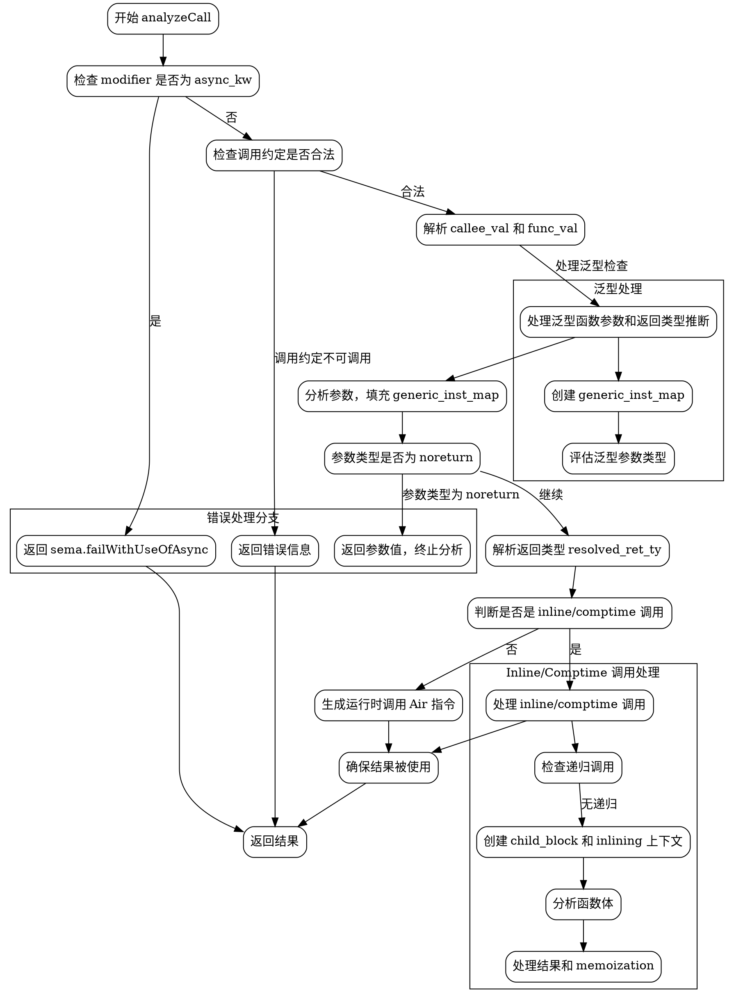

嗯，用户让我用graphviz来画这个Zig函数的流程图。首先，我需要仔细看一下这个函数的结构。函数名是analyzeCall，看起来是处理函数调用的语义分析部分。代码挺长的，里面有很多条件判断和错误处理。

首先，我需要理清函数的主要流程。函数开始检查modifier是否是async，如果是的话返回错误。然后处理func_ty_info的调用约定，如果不合法也报错。接着解析callee的值，判断是否是comptime-known的函数或者extern函数。

然后处理泛型函数的情况，包括参数和返回类型的推断。这里可能涉及到创建generic_block和generic_inst_map。接下来处理参数，逐个分析每个参数的类型，并填充到inst_map中。之后处理返回类型，特别是泛型返回类型的推断。

然后根据是否是inline或comptime调用，分支出不同的处理路径。如果是运行时调用，生成对应的Air指令；如果是inline或comptime调用，则进入子块分析函数体，处理参数映射，处理错误返回跟踪，处理递归调用检查，最后处理结果并返回。

接下来需要考虑各个条件分支，比如modifier的不同值，是否泛型，是否是inline调用，是否有comptime参数等等。每个条件分支都需要在流程图中体现出来。

可能需要注意的节点包括：

1. 检查modifier是否为async，失败处理。
2. 检查调用约定是否合法。
3. 解析callee的值，判断是否是comptime或extern。
4. 处理泛型函数的参数和返回类型推断。
5. 处理参数分析，填充inst_map。
6. 处理返回类型推断。
7. 根据是否是inline/comptime调用，分支出不同的处理路径。
8. 运行时调用生成Air指令。
9. inline调用处理，包括递归检查、参数映射、函数体分析。
10. 结果处理和错误检查。

需要将每个主要步骤作为节点，条件判断作为分支，错误处理作为单独的分支。同时，注意函数中的defer语句可能影响流程，比如恢复block.comptime_reason等，但流程图主要关注主要路径，可能不需要详细体现defer的内容。

可能的结构是：

开始 -> 检查modifier.async -> 是：返回错误
-> 否：检查调用约定 -> 不合法：返回错误
-> 合法：解析callee_val和func_val
-> 处理泛型函数参数和返回类型推断
-> 分析参数，填充inst_map
-> 处理返回类型
-> 判断是否是inline/comptime调用
   -> 是：进入inline处理，处理参数，分析函数体，处理结果
   -> 否：生成运行时调用的Air指令，处理结果
-> 确保结果被使用
-> 返回结果

同时，每个错误路径都要有对应的处理节点，比如返回错误信息，添加错误注释等。

需要注意函数中有多个可能的返回点，比如在参数分析时遇到noreturn类型直接返回，或者在处理过程中遇到错误直接返回错误。这些都需要在流程图中体现。

可能还需要处理memoization的部分，但可能作为inline路径中的一个子步骤。

总之，流程图需要覆盖所有主要判断和处理步骤，用条件分支连接，确保逻辑清晰。
================================================

此流程图通过以下方式组织逻辑：
1. 入口检查 async 修饰符
2. 核心调用约定校验
3. 泛型函数参数/返回类型推断
4. 参数分析与 noreturn 短路返回
5. 返回类型解析
6. 分支进入运行时调用或 inline/comptime 调用
7. 最终结果校验与返回

关键分支用条件判断节点连接，子流程用子图表示（如 inline 调用和泛型处理）。错误处理集中展示在左侧子图，主流程保持线性阅读顺序。