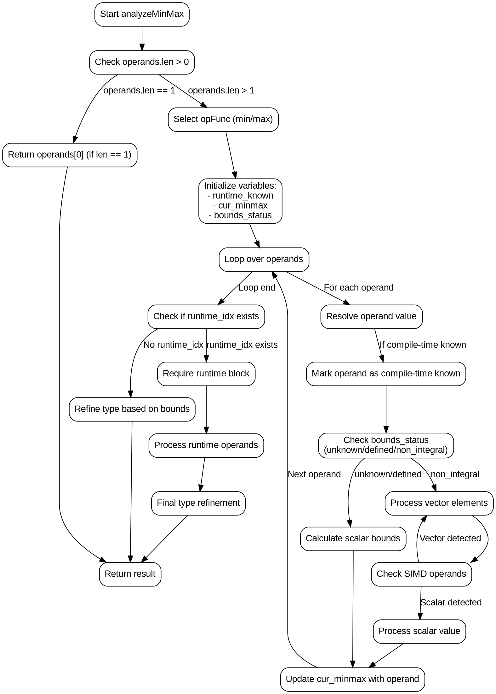

嗯，用户让我用Graphviz来画这个Zig函数的流程图。首先，我需要仔细阅读这个函数，理解它的逻辑结构。这个函数名为analyzeMinMax，看起来是处理最小值和最大值的计算，可能涉及到编译时的类型检查和运行时的操作。

首先，我应该理清函数的主要步骤。函数开始有一些断言，然后处理只有一个操作数的情况直接返回。接下来根据air_tag选择min或max的操作函数。然后初始化一些变量，比如runtime_known的位集合，当前的最小/最大值，以及边界状态。

接下来是遍历所有操作数，处理编译时已知的值，更新当前的min/max，并处理向量和标量的情况。之后，处理运行时已知的操作数，生成相应的指令，并再次细化类型。最后，根据已知的边界调整类型，返回结果。

为了画流程图，我需要将这个过程分解成各个步骤，并用节点表示每个操作或判断，箭头表示流程的方向。需要注意循环和条件分支的结构，比如遍历操作数的循环，以及处理运行时和编译时操作数的不同路径。

可能的节点包括：开始、检查操作数数量、选择操作函数、初始化变量、遍历操作数的循环、处理每个操作数的不同情况（编译时已知、运行时已知）、处理边界状态、生成指令、类型细化等。每个判断点需要分支出不同的路径，例如操作数数量是否为1，是否是min或max，边界状态的变化等。

需要注意的是，Graphviz使用DOT语言，需要用有向图来表示流程。每个节点用方框或菱形表示，箭头连接各个步骤。可能需要使用子图来组织循环结构，但Graphviz的子图处理可能比较复杂，所以可能需要用简单的节点和边来表示循环。

在绘制时，要确保每个条件判断都有两个或多个出口，例如“是”和“否”分支。处理操作数的循环部分可能需要一个循环节点，内部包含处理每个操作数的步骤。此外，处理运行时操作数和编译时操作数的不同路径需要明确分开。

另外，函数中有一些错误处理和类型检查，比如requireRuntimeBlock，这些也需要在流程图中体现出来。最后，类型细化和返回结果的部分需要作为流程的结束点。

需要确保流程图的逻辑正确，覆盖所有可能的路径，尤其是条件分支和循环部分。可能需要多次检查代码，确认每个步骤的顺序和依赖关系，避免遗漏重要步骤或判断条件。
================================================
