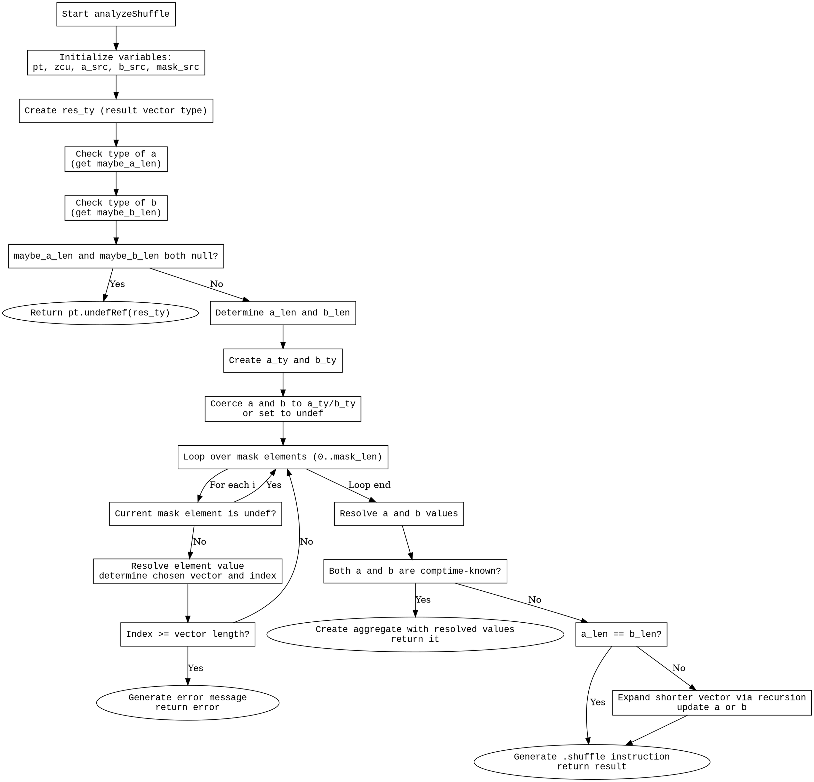

好的，我需要为给定的 Zig 函数 `analyzeShuffle` 生成一个 Graphviz 的流程图。首先，我要仔细理解这个函数的逻辑结构，然后逐步拆分成各个节点和判断条件。

首先，函数开始时会进行一些初始化，比如获取 `pt` 和 `zcu`，然后处理参数 `a` 和 `b` 的源信息。接下来，它会创建 `res_ty` 作为结果的向量类型。

然后，函数检查 `a` 和 `b` 的类型是否为数组或向量，如果不是，则返回错误。这里有两个主要的条件判断：`maybe_a_len` 和 `maybe_b_len`。如果两者都为 null，则返回 undefined。否则，确定 `a_len` 和 `b_len` 的值。

接着，根据 `a_len` 和 `b_len` 创建对应的向量类型 `a_ty` 和 `b_ty`，并对 `a` 和 `b` 进行类型强制转换或设置为 undefined。

然后进入一个循环，遍历 mask 的每个元素。检查每个元素是否越界，如果越界则生成错误信息。这里有一个循环结构，内部包含条件判断，处理正负索引，并检查是否超出范围。

之后，处理静态分析，如果 `a` 和 `b` 的值都可以解析，则生成对应的聚合值。否则，处理运行时的情况，确保两个向量的长度相同。如果长度不同，则递归调用 `analyzeShuffle` 来扩展较短的向量，直到长度一致。

最后，生成并返回 `shuffle` 指令。

接下来，我需要将这些步骤转化为流程图节点。需要注意条件分支，比如错误检查、循环处理、递归调用等。每个判断点需要有分支，如成功或失败路径。同时，循环结构需要用合适的流程表示。

可能的结构节点包括：

1. 开始
2. 初始化变量（pt, zcu, a_src, b_src, mask_src）
3. 创建 res_ty
4. 检查 a 的类型，获取 maybe_a_len
5. 检查 b 的类型，获取 maybe_b_len
6. 判断 maybe_a_len 和 maybe_b_len 是否都为 null
7. 确定 a_len 和 b_len
8. 创建 a_ty 和 b_ty
9. 强制转换 a 和 b 的类型或设置为 undef
10. 遍历 mask 的每个元素：
    a. 检查元素是否 undef，跳过
    b. 处理正负索引
    c. 检查是否越界，生成错误信息
11. 解析 a 和 b 的值，生成聚合值或处理运行时情况
12. 检查 a_len 和 b_len 是否相等，如果不相等，递归调用扩展向量
13. 生成 shuffle 指令并返回

每个步骤需要转换为流程图中的节点，条件判断作为分支。例如，步骤6中的条件判断会分出两个分支：如果都为 null，则返回 undef；否则继续。步骤10中的循环需要表示循环体中的各个判断。

在绘制时，需要注意条件之间的连接，确保流程正确。例如，错误路径应直接指向错误返回，而正常路径继续执行后续步骤。递归调用部分需要指出调用后的返回点。

最后，确保所有可能的路径都被覆盖，没有遗漏条件分支或步骤。这样生成的 Graphviz 流程图才能准确反映函数的执行逻辑。
================================================
