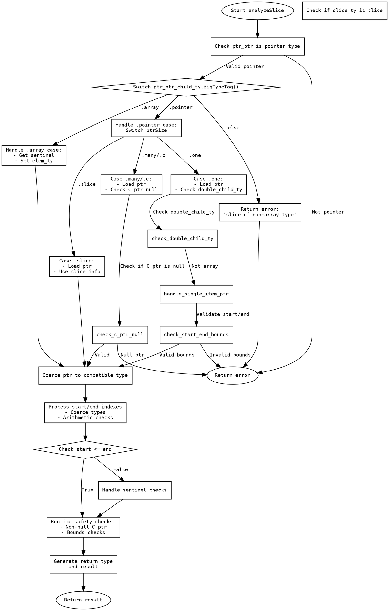

嗯，我需要为给定的Zig函数`analyzeSlice`绘制一个流程图。首先，我得仔细阅读这个函数的代码，理解它的逻辑结构，然后将其分解成不同的步骤和条件判断，以便用Graphviz的dot语言画出流程图。

首先，函数`analyzeSlice`的参数很多，处理各种切片分析的情况。函数开始部分检查`ptr_ptr`的类型是否为指针类型，如果不是，就返回错误。接下来，根据指针的子类型（数组、指针等）进行不同的处理。例如，如果是数组类型，会处理sentinel和元素类型；如果是单指针，则需要进行边界检查，确保start和end的值在允许的范围内。

然后，函数处理不同类型的指针，如C指针、多指针、切片指针等，每种类型有不同的逻辑。例如，对于C指针，需要检查是否为null；对于切片类型，需要加载指针并处理长度。

接下来，函数处理start和end索引，进行类型转换和算术运算，确保它们的值在合理的范围内，并进行各种错误检查，如索引越界、start大于end等。同时，处理sentinel值，确保切片末尾的sentinel正确。

最后，根据不同的情况生成返回类型，可能是指针或切片，并进行运行时安全检查，如检查指针非空、索引有效性等。

绘制流程图时，需要将上述步骤分解成节点，每个节点代表一个主要操作或条件判断。条件判断会导致不同的分支，例如类型检查是否通过，是否遇到错误情况等。每个处理步骤之间用箭头连接，表示执行顺序。

需要注意的是，由于函数中存在多个嵌套的条件分支（如switch语句、if-else结构），流程图需要正确反映这些分支结构。例如，当处理`ptr_ptr_child_ty`的类型时，会有多个case分支，每个分支对应不同的处理逻辑。

可能的流程节点包括：
1. 检查`ptr_ptr`是否为指针类型。
2. 根据`ptr_ptr_child_ty`的类型进行分支处理。
3. 处理数组类型，提取sentinel和元素类型。
4. 处理单指针类型，检查start和end的边界。
5. 处理C指针、多指针、切片指针等不同类型。
6. 加载指针并处理错误情况。
7. 处理start和end索引，进行类型转换和运算。
8. 检查索引是否越界，start是否小于等于end。
9. 处理sentinel值，确保正确性。
10. 生成返回类型并进行安全检查。
11. 返回结果或错误。

每个步骤中的错误处理需要作为单独的分支，例如返回错误信息。此外，循环或递归的结构需要正确表示，但在此函数中似乎没有明显的循环，主要是条件分支。

在绘制Graphviz图时，使用节点形状来表示不同的操作类型，例如矩形框表示过程步骤，菱形表示条件判断，椭圆形表示开始和结束节点。箭头表示流程的方向，条件分支的标签需要明确说明条件内容。

现在需要将上述分析转化为具体的Graphviz dot代码，确保每个步骤和分支都被正确表示，并保持逻辑的连贯性和正确性。同时，要注意代码的结构清晰，避免节点和边过于混乱，可能需要使用子图来组织复杂的分支结构。
================================================
