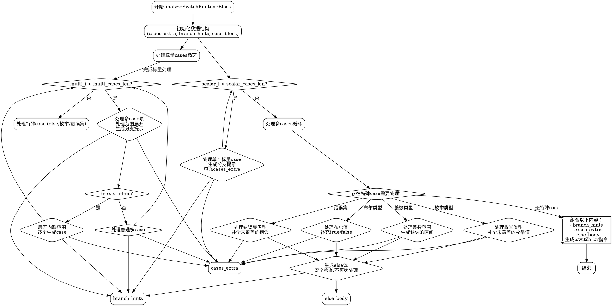

好的，我需要为给定的Zig函数`analyzeSwitchRuntimeBlock`绘制一个流程图。首先，我需要理解这个函数的结构和逻辑流程。

首先，函数参数非常多，说明这个函数处理复杂的逻辑，可能与编译器中的switch语句分析有关。函数内部有许多变量声明和初始化，比如`cases_extra`、`branch_hints`、`case_block`等，这些可能用于存储不同case的信息和分支提示。

接下来，函数主要分为几个部分：

1. **初始化阶段**：初始化各种数据结构和变量，例如`cases_extra`和`branch_hints`的初始化，以及`case_block`子块的创建。
2. **处理标量case（scalar cases）**：通过循环遍历`scalar_cases_len`，处理每个标量case，生成对应的分支提示和case信息。
3. **处理多case（multi cases）**：同样通过循环处理`multi_cases_len`，处理包含多个项或范围的case，可能涉及范围展开和内联处理。
4. **处理特殊case（special prong）**：处理else分支或其他特殊情况，可能包括枚举、错误集、整数范围等的处理。
5. **生成最终的Air指令**：将收集到的所有case信息、分支提示和else体组合成Air指令，添加到当前块中。

在绘制流程图时，需要将这些主要步骤作为不同的节点，并用箭头表示执行顺序。每个循环结构（如`while`循环）需要以条件判断的形式体现。例如，处理标量case的循环可以用一个判断节点，当`scalar_i < scalar_cases_len`时继续处理，否则退出循环。

需要注意的是，函数中有多个嵌套的条件判断和循环，例如在处理多case时，存在内联展开的情况，需要根据`info.is_inline`决定是否展开。此外，特殊case的处理涉及多个类型判断（如枚举、错误集、布尔值等），每个类型有不同的处理逻辑，这些都需要在流程图中分支出不同的路径。

另外，错误处理和安全性检查（如`safetyPanic`）也是流程中的重要部分，需要在相应的条件分支中体现。

最后，生成Air指令的部分需要汇总之前处理的所有case和else信息，组合成最终的指令并返回。

在绘制过程中，应确保每个主要步骤和条件判断清晰可见，使用菱形表示条件分支，矩形表示处理步骤，箭头指示流程方向。需要特别注意循环结构和嵌套条件，避免流程线交叉混乱。
================================================
