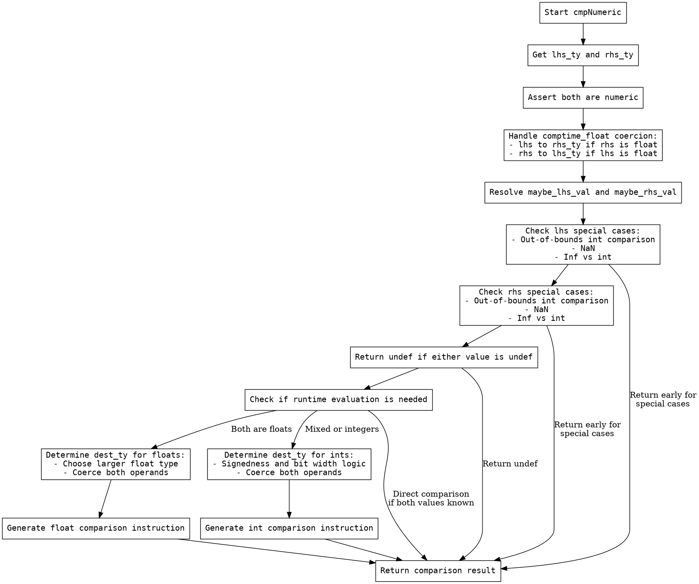

嗯，我现在需要画这个Zig函数cmpNumeric的流程图。首先，我需要理解这个函数的结构和逻辑流程。看起来这个函数是用来比较两个数值类型的操作数，处理各种类型转换和特殊情况，比如NaN、无穷大、编译时常量等。

首先，函数开始的时候，会获取两个操作数的类型，并进行断言确保都是数值类型。然后处理一些特殊情况，比如comptime_float和float之间的强制类型转换。接下来，尝试解析两个操作数的值，看看是否是常量或者有未定义的值。

然后，检查左侧和右侧的值是否有一些特殊情况，比如超出类型范围的比较结果，或者NaN的情况。如果其中一个是NaN，那么根据操作符返回true或false。类似地，处理无穷大和整数的比较。

接下来，如果两个值都是运行时已知的，直接比较它们的结果。否则，需要生成运行时代码来处理比较。对于浮点数，选择更大的类型作为目标类型，并添加对应的比较指令。对于整数和混合类型的比较，需要考虑符号和位数，确定目标类型，然后进行类型转换和比较。

流程图中需要包括所有的条件判断，比如类型检查、是否为常量、是否有特殊情况（NaN、无穷大）、是否需要类型转换等。每个条件分支都要有对应的处理步骤，最后生成相应的比较操作。

可能需要注意的步骤包括：处理comptime_float的转换、检查NaN、处理无穷大与整数的比较、确定目标类型、进行类型强制转换、生成比较指令等。每个判断点都需要在流程图中体现出来，比如if-else结构，循环可能不存在，但条件分支很多。

需要确保流程图的逻辑顺序正确，覆盖所有可能的分支情况。比如，先处理左侧是否为常量，再处理右侧是否为常量，然后是运行时处理，浮点数和整数处理的不同路径等。可能还需要处理错误情况，比如类型转换失败时的错误返回。

最后，生成流程图的时候，使用graphviz的语法，用节点和箭头连接各个步骤，确保每个判断框和处理步骤都清晰可见。可能需要使用菱形表示判断节点，矩形表示处理步骤，箭头表示流程方向。
================================================
