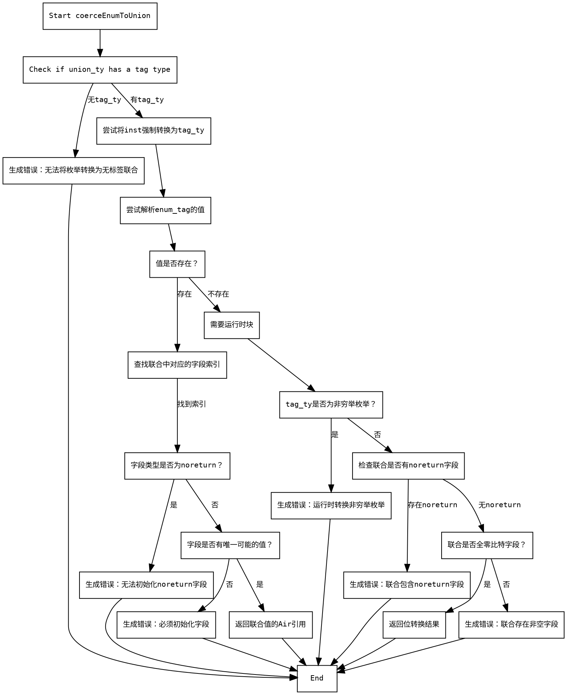

好的，我现在需要为给定的Zig函数`coerceEnumToUnion`绘制流程图。首先，我要理解这个函数的结构和逻辑流程。这个函数的主要目的是将枚举类型强制转换为联合类型，处理各种错误情况，并在可能的情况下进行类型检查和转换。

首先，我会通读代码，识别主要的条件分支和错误处理部分。函数开始于获取一些类型信息，然后检查联合类型是否有标签类型。如果没有标签类型，会生成错误信息并返回失败。

接下来，尝试将枚举类型强制转换为标签类型。如果成功解析到值，检查该值是否对应于联合类型的某个字段。如果字段不存在，同样生成错误。然后，检查字段类型是否为`noreturn`，如果是则报错。接着，检查字段类型是否只有一个可能的值，如果不是，报错并要求初始化字段。

如果无法在编译时解析值，需要运行时检查。如果标签类型是非穷举枚举，则报错。然后，检查联合类型是否有`noreturn`字段，如果有则报错。

如果联合类型的所有字段都是零比特，直接进行位转换。否则，生成错误信息，指出存在非空字段。

现在，我需要将这些步骤转化为流程图中的节点和分支。每个条件判断对应一个菱形节点，不同的处理路径对应不同的箭头。错误处理部分可能会有多个出口，而正常流程则继续执行后续步骤。

需要注意函数中的多个返回点，每个错误情况都会生成错误消息并返回。需要确保流程图中涵盖所有可能的路径，包括错误路径和正常执行路径。

在绘制流程图时，使用Graphviz的DOT语言，定义各个节点并用箭头连接它们。每个条件判断后有两个分支（是/否），处理不同的情况。同时，错误处理部分可能需要连接到多个节点，或者直接终止流程。

最后，检查是否有遗漏的条件或处理步骤，确保流程图准确反映函数的逻辑。
================================================
