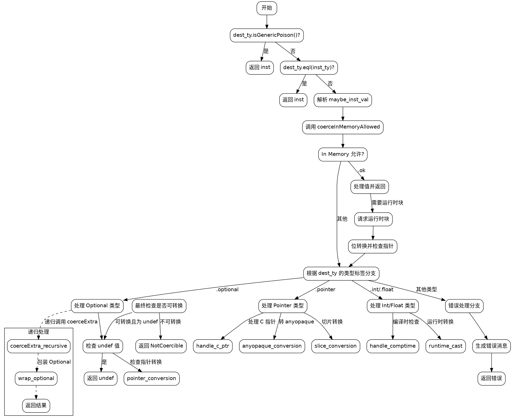

嗯，我需要画这个Zig函数的流程图。首先，我得仔细阅读这个函数，理解它的逻辑结构。函数名是coerceExtra，看起来是处理类型转换的。函数内部有很多条件判断，比如检查目标类型和实例类型是否相同，处理不同的类型标签（如optional、pointer、int等），以及错误处理。

首先，我应该确定函数的主要分支。函数开始检查dest_ty是否是Generic Poison，如果是就直接返回inst。接着比较目标类型和实例类型是否相同，相同的话也返回inst。然后处理各种类型标签，比如optional、pointer、int、float等，每个标签下又有不同的处理逻辑。

接下来，我需要将这些条件分支转化为流程图中的节点和判断框。例如，第一个判断是dest_ty.isGenericPoison()，如果是，返回inst；否则继续。然后比较dest_ty和inst_ty是否相等，相等则返回inst。之后处理maybe_inst_val，尝试解析值，接着调用coerceInMemoryAllowed，根据结果处理不同的情况。

对于每个类型标签（如.optional、.pointer），需要分别处理不同的子情况。比如在.optional分支里，处理null、undef，以及指针转换等。每个子分支可能有进一步的判断，比如检查指针属性、元素类型等。

另外，函数中有很多错误处理，比如返回error.NotCoercible，或者生成错误消息。这些需要在流程图中体现为错误处理的节点。

需要注意的是，这个函数非常复杂，有很多嵌套的条件和递归调用（比如sema.coerceExtra的递归调用）。在画流程图时，可能需要简化一些细节，但必须保留主要的逻辑分支。

可能的结构是：

1. 开始
2. 检查Generic Poison → 返回inst
3. 检查类型是否相同 → 返回inst
4. 解析maybe_inst_val
5. 调用coerceInMemoryAllowed
6. 根据结果处理In Memory允许的情况
7. 进入类型标签的Switch Case
   a. Optional处理
   b. Pointer处理
   c. Int/Float处理
   d. 其他类型处理
8. 错误处理分支
9. 生成错误消息并返回错误

每个主要分支需要细化，比如在Pointer处理中，可能有多个子分支：检查指针类型、处理C指针、转换为anyopaque等。

同时需要注意递归调用的情况，比如在处理optional时，递归调用coerceExtra来处理子类型，这在流程图中可能需要表示为子流程或单独的处理节点。

可能遇到的挑战是如何将复杂的嵌套条件结构清晰地呈现在流程图中，避免过于拥挤。可能需要使用子图（subgraphs）来组织不同的类型处理分支，或者将部分逻辑合并为更高级别的节点。

最后，确保所有可能的路径都被覆盖，包括错误返回和正常返回的情况，以及各种类型转换的成功或失败处理。
================================================
