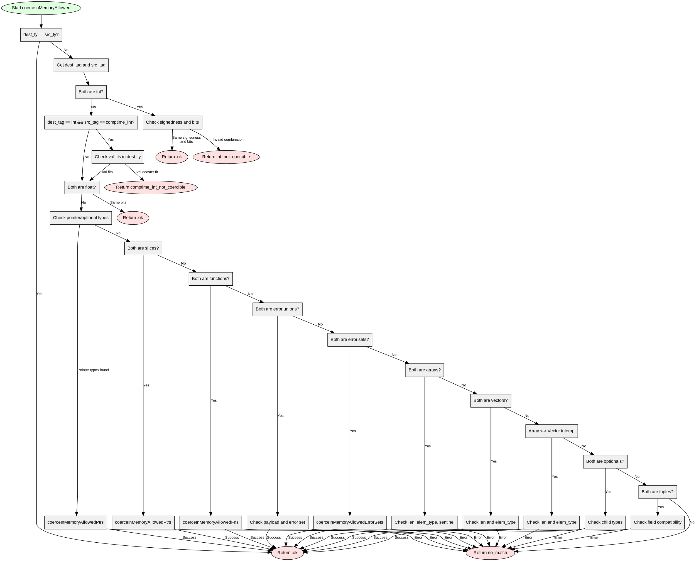

嗯，用户让我用Graphviz来画这个Zig函数的流程图，而且不能用Mermaid。首先，我需要仔细看一下这个函数的结构，理解每个条件分支和返回的情况。这个函数叫coerceInMemoryAllowed，看起来是处理类型转换的检查，根据不同的类型标签（比如int、float、指针等）进行不同的处理，并返回相应的结果。

首先，我需要确定函数的主要流程。函数一开始检查目标类型和源类型是否相等，如果相等就直接返回.ok。接着检查各种类型组合，比如整数类型、浮点类型、指针、切片、函数、错误联合体、数组、向量、可选类型、元组等。每个类型都有特定的处理逻辑，可能会有递归调用，比如在处理数组或向量时检查元素类型是否兼容。

接下来，我需要把每个条件分支转化为流程图中的节点和边。比如，第一个条件是检查dest_ty和src_ty是否相等，如果是，返回.ok。如果不是，继续检查它们的类型标签。每个类型标签对应的处理逻辑需要作为一个分支节点，比如检查是否是整数类型，然后进一步比较符号和位数，等等。

需要注意的是，有些分支可能会递归调用coerceInMemoryAllowed，比如在处理数组元素类型或错误联合体的负载类型时。这时候在流程图中可能需要表示递归调用的节点，或者简化处理，避免图表过于复杂。

另外，函数中有多个返回点，每个条件分支可能返回不同的结果，比如.int_not_coercible、.comptime_int_not_coercible等错误情况，或者继续处理其他类型。每个返回点都需要在流程图中体现。

可能遇到的挑战是如何组织这么多条件分支，确保每个路径都被正确表示，同时保持流程图的可读性。可能需要将相似的类型处理分组，比如将指针、切片、函数等归类为指针类处理，数组和向量作为另一类，错误联合体和错误集合作为另一类，等等。

还需要注意函数参数中的dest_is_mut标志，当它为true时，需要双向检查类型兼容性，这在处理错误集合时特别重要。这部分逻辑需要在流程图中明确表示，比如在错误集合处理时，如果dest_is_mut为true，则需要检查两个方向的兼容性。

最后，确保所有可能的返回情况都被覆盖，包括最后的默认返回.no_match的情况。每个条件分支的结束点都应该连接到相应的返回节点。

总结步骤：
1. 确定函数的主要条件分支结构。
2. 为每个条件创建节点，并连接相应的处理流程。
3. 处理递归调用的情况，可能需要用子流程或简化表示。
4. 确保所有返回情况都有对应的节点。
5. 使用Graphviz语法构建流程图，注意节点和边的正确连接。
================================================
