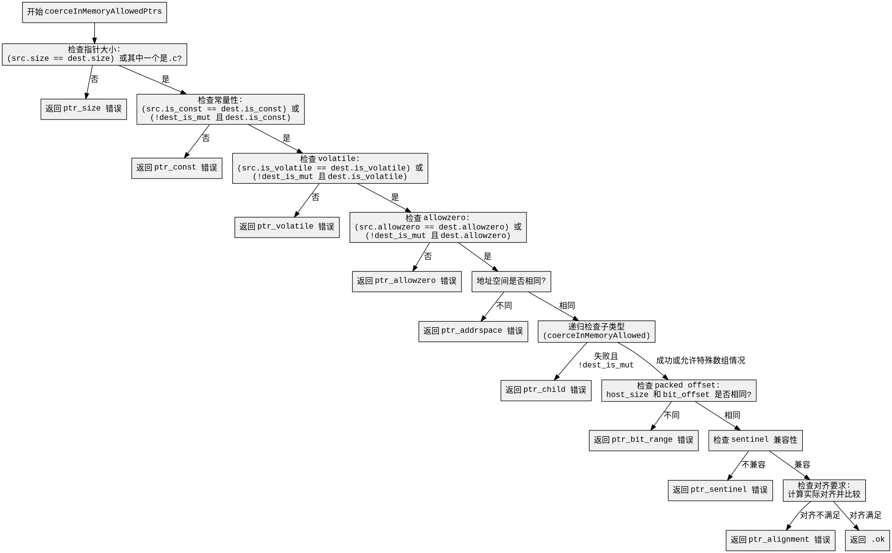

好的，我需要为给定的 Zig 函数 `coerceInMemoryAllowedPtrs` 生成 Graphviz 的流程图。首先，我需要理解这个函数的结构和逻辑流程，然后将每个判断和返回步骤转化为流程图中的节点和分支。

首先，函数开始时会获取 `dest_ptr_ty` 和 `src_ptr_ty` 的指针信息。然后进行一系列的条件检查：

1. **指针大小检查**：检查 `src_info.flags.size` 和 `dest_info.flags.size` 是否相同，或者其中一个是 `.c` 类型。如果不符合，返回 `ptr_size` 错误。

2. **常量性检查**：检查 `is_const` 标志是否一致，或者目标不是可变的情况下允许目标为常量。失败则返回 `ptr_const` 错误。

3. **volatile 检查**：类似常量检查，处理 `is_volatile` 标志，失败返回 `ptr_volatile` 错误。

4. **allowzero 检查**：确认 `allowzero` 属性是否匹配，或者目标不可变时允许目标有 `allowzero`。失败返回 `ptr_allowzero` 错误。

5. **地址空间检查**：比较地址空间是否相同，不同则返回 `ptr_addrspace` 错误。

接下来，处理指针的子类型（child type），递归调用 `coerceInMemoryAllowed`。如果子类型检查失败且目标不可变，允许特殊情况（如数组 sentinel 处理），否则返回 `ptr_child` 错误。

然后是 **packed offset** 检查，比较主机大小和位偏移，不同则返回 `ptr_bit_range` 错误。

**Sentinel 检查**：确认 sentinel 是否兼容，不符合则返回 `ptr_sentinel` 错误。

最后是 **对齐检查**，计算源和目标的实际对齐，根据条件比较，失败返回 `ptr_alignment` 错误。

所有检查通过后返回 `.ok`。

接下来需要将这些步骤转化为流程图。每个条件判断对应一个菱形节点，每个返回路径对应不同的终端节点。需要注意递归调用部分可能需要简化处理，避免流程图过于复杂。

需要确保每个条件分支正确连接，并且所有可能的返回路径都被覆盖。同时，保持流程图的清晰和可读性，合理排列节点位置，减少交叉线。
================================================
