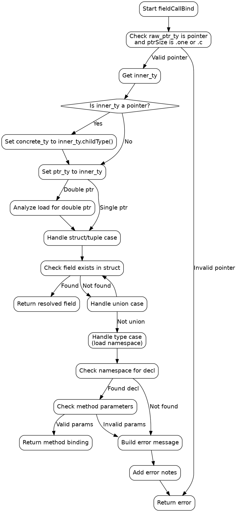

好的，我需要为提供的Zig函数`fieldCallBind`生成一个Graphviz流程图。首先，我需要仔细阅读代码，理解其逻辑结构和各个分支。

函数的主要目的是解析字段调用绑定，处理指针和结构体/联合体等类型的字段访问。首先，函数会检查指针类型，确定是单指针还是双指针，然后获取具体的类型。接着，根据具体类型的不同（如结构体、联合体、类型等），进行不同的处理。如果找不到字段，会查找命名空间中的声明，最后处理错误情况。

接下来，我需要将这个过程分解为不同的步骤，并确定每个步骤之间的流程和条件分支。例如，检查指针类型是否为单指针或双指针，处理结构体字段查找，处理联合体字段查找，检查是否有声明的方法，以及错误处理等。

在绘制流程图时，需要注意各个条件判断（如switch语句中的不同case），以及循环结构（如for循环遍历结构体字段）。同时，错误处理部分也需要明确标注，包括生成错误消息和返回错误结果。

需要确保流程图中的每个节点和边都正确反映代码的逻辑，包括条件分支、循环、函数调用和返回语句。还要注意代码中的标签（如`find_field`和`found_nav`）以及它们如何影响流程。

最后，使用Graphviz的DOT语言将这些逻辑步骤转换为图形表示，确保结构清晰，层次分明，便于理解整个函数的执行流程。
================================================
