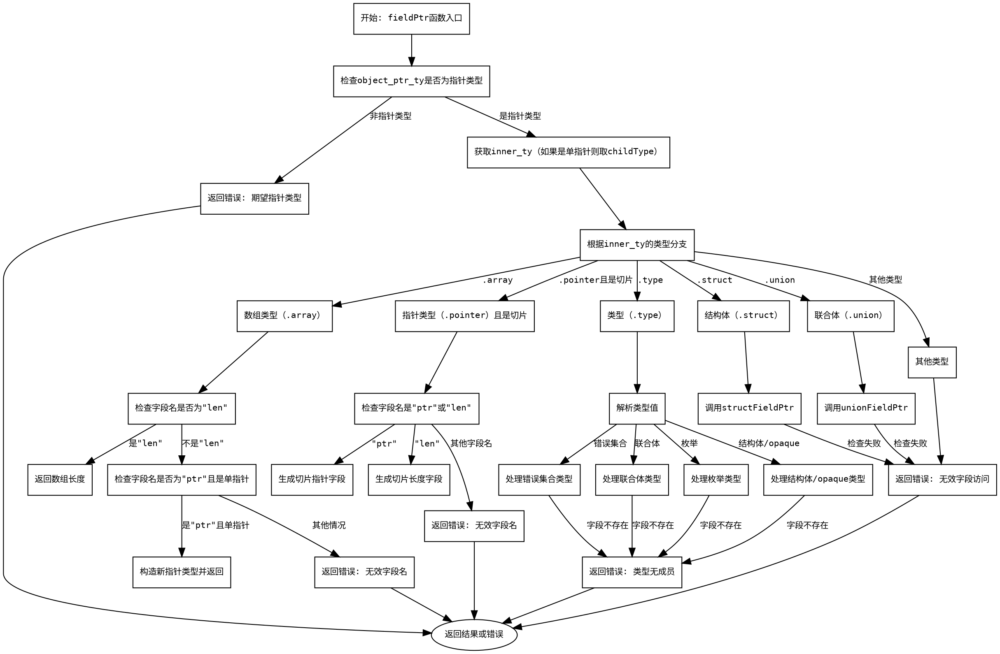

好的，我需要为给定的Zig函数`fieldPtr`绘制一个Graphviz流程图。首先，我应该仔细阅读代码，理解其逻辑结构，然后将其分解为不同的步骤和条件分支。

函数`fieldPtr`的主要功能是根据给定的对象指针和字段名，获取对应字段的指针。它处理多种类型，如数组、指针、结构体、联合体等，每种类型有不同的处理逻辑。

首先，函数开始部分检查对象指针的类型是否为指针类型，如果不是则报错。接着，处理不同类型的逻辑分支：

1. **数组类型（.array）**：
   - 检查字段名是否为"len"或"ptr"，分别处理数组长度和指针转换。
   - 如果字段名不匹配，返回错误。

2. **指针类型（.pointer），特别是切片（slice）**：
   - 处理切片的"ptr"和"len"字段，生成对应的指针类型。
   - 需要加载指针的值，并检查是否为运行时值。

3. **类型（.type）**：
   - 处理错误集合、联合体、枚举、结构体等类型，查找字段或成员。
   - 如果找不到成员，返回错误。

4. **结构体（.struct）和联合体（.union）**：
   - 调用相应的结构体或联合体字段指针处理函数。
   - 检查指针的有效性。

5. **其他类型**：
   - 如果都不匹配，返回无效字段访问错误。

接下来，我需要将这些逻辑步骤转换为流程图节点，并用条件分支连接。每个条件判断对应一个菱形节点，处理逻辑对应矩形节点，错误处理作为终止节点。

需要注意的地方包括：
- 函数开头检查对象指针类型是否为指针，如果不是则直接报错。
- 处理不同类型时，如数组、指针、结构体等，各自有不同的分支。
- 每个分支内部可能有进一步的判断，例如数组类型检查字段名是否为"len"或"ptr"。
- 错误处理分布在各个条件分支中，最终统一返回错误节点。

绘制时，应确保流程图的逻辑清晰，条件分支正确对应代码中的判断语句。使用Graphviz的语法定义节点和边，合理排列结构，避免交叉过多。
================================================
