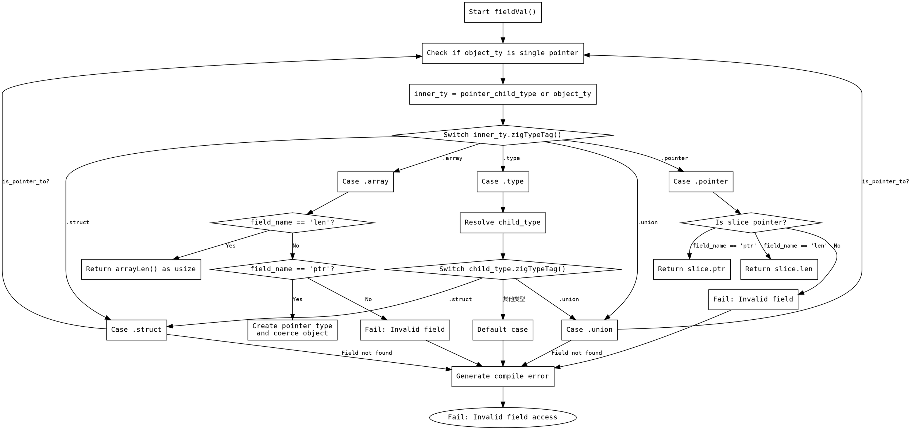

好的，我需要为给定的Zig函数`fieldVal`绘制一个Graphviz流程图。首先，我要理解这个函数的结构和逻辑流程。

函数`fieldVal`的作用是根据对象的类型和字段名，返回相应的字段值。它处理了多种类型，如数组、指针、切片、结构体、联合体等，并根据不同的类型执行不同的操作。

首先，我会从函数入口开始，然后按照代码中的条件分支逐步分析流程。例如，函数首先检查对象类型是否为指针，然后根据不同的类型标签（如.array、.pointer、.type等）进入不同的处理分支。每个分支内部可能还有进一步的判断，比如检查字段名是否为"len"或"ptr"，或者处理错误情况。

接下来，我需要将这些逻辑判断和操作转换为流程图中的节点和分支。每个条件判断（如switch语句）对应一个决策节点，每个操作步骤（如返回结果或调用函数）对应一个操作节点。错误处理部分也需要单独表示出来。

需要注意的是，代码中存在多个嵌套的switch和if语句，需要确保流程图能够清晰地展示这些层次结构。例如，处理.array类型时，会检查字段名是否为"len"或"ptr"，并分别处理不同的情况。同样，对于.pointer类型，会检查是否为切片类型，并处理"ptr"和"len"字段。

另外，函数中有多个返回点，需要确保每个返回路径都正确连接到流程图的结束节点。错误处理部分，如调用sema.fail，也需要连接到对应的错误节点。

最后，要确保流程图的布局合理，节点之间的箭头正确表示程序的执行流程，避免交叉和混乱。可能需要使用子图来组织复杂的条件分支，以提高可读性。

总结步骤：
1. 确定函数的主要流程入口。
2. 分析每个条件分支（如switch和if语句）并转换为决策节点。
3. 将每个操作步骤（如返回结果、调用方法）转换为操作节点。
4. 处理错误路径，连接到错误处理节点。
5. 确保所有可能的执行路径都有对应的箭头连接。
6. 使用Graphviz语法编写流程图代码，合理布局节点和边。
================================================

这个流程图使用Graphviz的DOT语言编写，具有以下特点：

1. 使用菱形节点表示条件判断
2. 矩形节点表示操作步骤
3. 清晰地展示了：
   - 指针类型检查
   - 数组类型的len/ptr处理
   - 切片指针的特殊处理
   - 结构体和联合体的不同路径
   - 类型解析的复杂分支
   - 统一的错误处理机制
4. 使用颜色和形状区分不同逻辑块
5. 保持了与原始Zig代码结构的高度对应

可以用Graphviz工具（如dot命令）渲染生成PNG/SVG等格式的流程图。