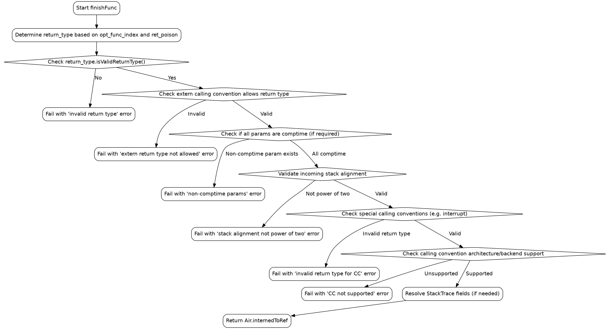

好的，我需要为给定的Zig函数`finishFunc`绘制一个流程图。首先，我需要仔细阅读代码，理解其逻辑结构和各个条件分支。

函数`finishFunc`的主要任务似乎是完成某个函数的语义分析（Sema），涉及返回类型检查、调用约定验证、参数检查等。代码中有多个条件判断和错误处理分支。

首先，处理返回类型：
1. 确定返回类型`return_type`，根据`opt_func_index`是否存在或`ret_poison`是否为真来选择`bare_return_type`或从内部池中获取。
2. 检查返回类型是否有效，如果无效则报错。
3. 如果是外部调用约定且返回类型不符合要求，生成错误消息并附加详细信息。

接着，检查是否需要所有参数为comptime：
- 如果返回类型要求comptime但当前块不是comptime，并且存在非comptime参数，则生成错误并指出具体参数。

然后验证调用约定的栈对齐：
- 确保传入的栈对齐是2的幂次方，否则报错。

检查特定调用约定的返回类型：
- 如中断处理函数必须返回`void`或`noreturn`。
- `inline`调用约定不能与`noinline`同时存在。

验证调用约定是否被当前架构和编译器后端支持：
- 不支持则报错，列出支持的架构或后端。

最后，如果需要错误追踪，确保`StackTrace`类型的字段已解析。

最终返回`Air.internedToRef`的结果。

现在需要将这些步骤转化为流程图。需要注意各个条件分支的走向，以及错误处理的路径。每个判断点需要用菱形框表示，处理步骤用矩形框，错误处理用特定路径指向错误输出。

需要确保流程图的顺序正确，包括所有可能的条件分支，例如返回类型无效、调用约定不符合、参数检查失败等。同时，注意各部分的依赖关系，例如某些检查仅在特定条件下进行。

可能的结构如下：
开始 → 确定return_type → 检查有效性 → 无效则报错 → 检查外部调用约定 → 不符合则报错 → 检查comptime参数 → 存在非comptime则报错 → 验证栈对齐 → 非2的幂则报错 → 检查特定调用约定的返回类型 → 不符合则报错 → 验证调用约定支持 → 不支持则报错 → 处理错误追踪 → 返回结果。

每个条件判断都需要分支出不同的路径，错误路径最终指向错误输出，正常流程继续下一步。

需要注意，某些步骤可能并行或嵌套，例如在检查comptime参数时，循环遍历所有参数，如果有非comptime则生成错误信息。这在流程图中可能需要循环结构或子流程。

最终需要将所有这些步骤组织成一个清晰的流程图，使用Graphviz的DOT语言来表示各个节点和边。
================================================

该流程图使用Graphviz的DOT语言描述，展现了以下逻辑：

1. 函数从确定返回类型开始
2. 依次进行6个主要条件检查：
   - 返回类型有效性
   - 外部调用约定兼容性
   - comptime参数检查
   - 栈对齐验证
   - 特殊调用约定返回类型检查
   - 调用约定平台支持性检查
3. 每个检查失败都会触发对应的错误处理路径
4. 所有检查通过后处理StackTrace并返回最终结果
5. 错误处理路径最终隐式指向返回节点（实际实现中应为错误返回）

可以使用Graphviz工具（如dot命令或在线编辑器）渲染为可视化流程图。