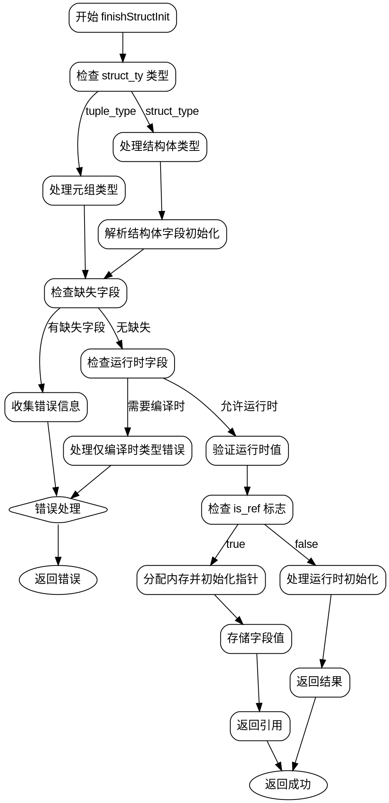

好的，我需要为给定的Zig函数`finishStructInit`生成一个Graphviz的流程图。首先，我需要理解这个函数的结构和逻辑流程。

函数开始于参数声明，然后处理`struct_ty`的类型，可能是元组或结构体类型。根据不同的类型，会有不同的处理分支。接着检查是否有字段初始化缺失，如果有错误则生成错误信息。然后处理运行时初始化，判断是否需要分配内存，存储指针，最后返回结果。

接下来，我需要将这个过程分解成步骤，并确定各个步骤之间的流程关系。可能的分支包括处理元组类型和结构体类型的不同情况，错误处理路径，以及根据`is_ref`标志处理引用的情况。

需要注意条件判断和循环结构，比如`for`循环遍历字段，以及可能的错误处理流程。此外，`errdefer`的存在意味着错误处理会在函数退出时执行，但流程图可能需要将其作为单独的分支。

最后，将这些步骤和分支用Graphviz的节点和边表示出来，确保逻辑正确，流程清晰。需要正确使用条件判断节点，合并重复的流程，并注意错误路径的终止点。
================================================
