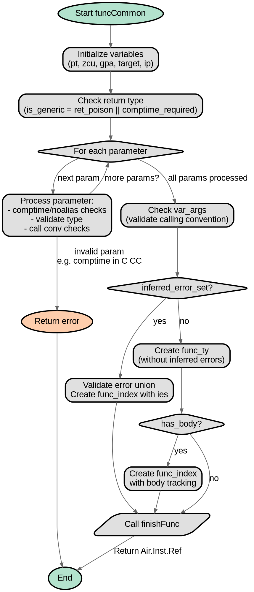

嗯，用户让我用Graphviz来画这个Zig函数的流程图。首先，我需要理解这个函数的结构。这个函数叫做funcCommon，看起来是处理函数声明的语义分析。参数挺多的，有sema、block、src_node_offset等等。函数内部有很多条件判断和错误处理。

首先，我应该确定函数的主要流程。函数开始部分初始化了一些变量，比如pt、zcu、gpa等。然后检查返回类型是否是comptime，接着遍历参数，处理每个参数的comptime、noalias等情况，并进行各种错误检查，比如参数类型是否允许在特定的调用约定下使用。

接下来，处理可变参数var_args的情况，检查是否允许。然后处理推断错误集inferred_error_set的情况，如果有的话，调用validateErrorUnionPayloadType，并生成func_index。之后根据是否有函数体has_body，分别处理两种情况，调用finishFunc函数返回结果。

如果没有推断错误集，则创建func_ty，同样根据是否有函数体，处理不同的逻辑，最后调用finishFunc。

现在需要考虑如何将这些步骤转化为流程图。流程图的节点应该是各个主要步骤，比如初始化变量、遍历参数、检查var_args、处理inferred_error_set、创建func_ty等。条件判断会导致分支，比如是否inferred_error_set，是否有has_body等。

需要注意的是，循环遍历参数的部分在流程图中可能需要表示为循环结构。不过Graphviz中循环通常用节点和边来表示，比如一个节点“遍历每个参数”，然后连接到处理每个参数的步骤，再回到循环判断是否还有参数。

错误处理部分，比如返回错误信息，应该作为分支的结束节点，可能用不同的形状或颜色标记。

还要注意函数最后的多个finishFunc调用，根据不同的条件路径，最终返回结果。

现在需要将这些步骤结构化，确定各个节点和它们之间的连接关系，确保逻辑正确，没有遗漏分支。

可能会遇到的挑战是处理复杂的条件嵌套，比如在遍历参数时的多个条件检查，每个条件可能导致不同的错误返回。需要确保每个可能的错误路径都有对应的节点和边。

另外，函数的某些部分可能调用其他函数，如sema.fail、finishFunc等，这些在流程图中可能不需要展开，只需作为处理步骤节点。

总结步骤：

1. 开始节点：函数入口。
2. 初始化变量（pt, zcu, gpa等）。
3. 检查返回类型是否是comptime，设置is_generic。
4. 遍历每个参数：
   a. 处理参数类型、comptime、noalias。
   b. 多个条件检查，如调用约定是否允许参数类型，参数是否有效等。
   c. 如果参数类型不符合要求，返回错误。
5. 处理var_args，检查调用约定是否支持。
6. 处理inferred_error_set：
   a. 验证错误联合类型。
   b. 生成func_index，调用finishFunc返回。
7. 如果没有inferred_error_set，创建func_ty。
8. 根据has_body生成func_index或直接调用finishFunc。
9. 结束节点：返回结果。

需要将这些步骤转化为Graphviz的节点和边，注意条件分支的表示，比如使用菱形节点表示判断条件，不同的边标记条件结果。

可能的结构图大致如下：

开始 -> 初始化变量 -> 检查返回类型 -> 遍历参数（循环）-> 处理每个参数的各种检查 -> 错误处理节点（如果有错误则结束） -> 处理var_args -> 判断inferred_error_set -> 是：处理错误联合并调用finishFunc -> 结束；否：创建func_ty -> 判断has_body -> 是：生成func_index并调用finishFunc -> 结束；否：直接调用finishFunc -> 结束。

循环遍历参数部分可能需要用子图来表示循环结构，但Graphviz中没有直接的循环语法，只能通过节点和边模拟。例如，参数遍历开始节点，处理参数，然后回到循环判断是否有更多参数。

错误处理节点可能需要连接到多个可能的错误返回路径。

现在需要将这些逻辑用Graphviz的DOT语言描述出来，确保结构清晰，节点和边正确反映函数流程。
================================================
