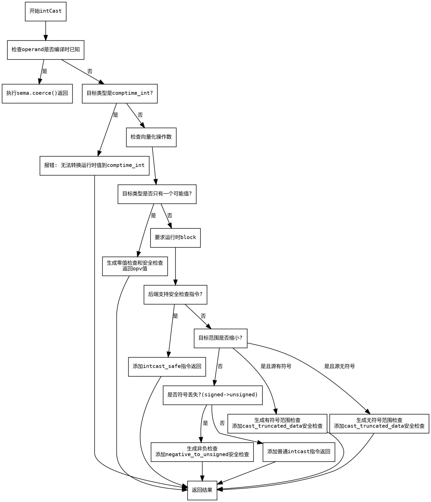

好的，我需要为给定的Zig函数`intCast`绘制一个流程图。首先，我需要理解这个函数的结构和逻辑流程。让我先通读代码，理清各个条件分支和操作步骤。

函数`intCast`的主要功能是执行整数类型转换，并包含多个安全检查。首先，它会检查操作数是否是编译时已知的，如果是，直接进行类型强制转换。如果不是，则检查目标类型是否是`comptime_int`，如果是，则报错。

接下来，函数处理向量化操作数的检查，并确定是否为向量类型。然后，检查目标类型是否只有一个可能的值（如u0类型），如果是，则生成相应的安全检查和返回结果。

如果目标类型不是单一值，函数进入运行时安全检查部分。这里分为几种情况：目标类型的位数是否小于源类型，导致范围缩小；以及有符号转无符号时的符号检查。每种情况都会生成相应的比较指令和安全检查，最后根据情况添加不同的安全panic。

在绘制流程图时，我需要将这些条件分支和操作步骤用图形化的方式表示出来。需要注意各个条件判断的顺序和嵌套关系，例如先检查是否编译时已知，再处理目标类型是否为comptime_int，接着处理单一可能值的情况，最后处理运行时安全检查和不同的范围检查情况。

此外，需要处理向量类型和标量类型的不同处理路径，例如在生成比较指令时，向量类型需要额外的reduce操作。同时，还要注意不同的panic类型（如.cast_truncated_data和.negative_to_unsigned）对应的条件分支。

最后，确保流程图的每个节点正确反映代码中的判断和操作，比如使用菱形表示条件判断，矩形表示操作步骤，箭头表示流程方向。确保所有可能的路径都被覆盖，没有遗漏任何分支。
================================================
