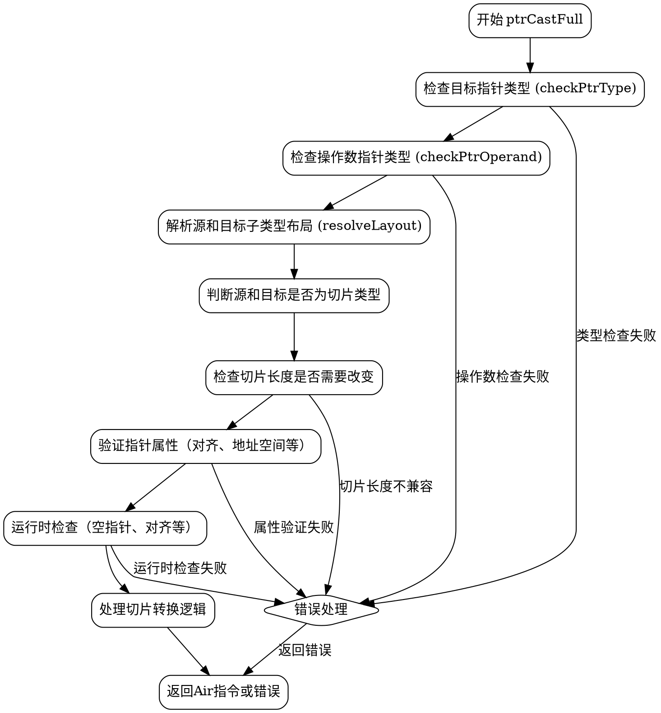

好的，我需要为给定的Zig函数`ptrCastFull`绘制一个流程图。首先，我需要理解这个函数的结构和逻辑流程。这个函数的主要功能是处理指针类型的转换，并进行各种检查以确保转换的有效性和安全性。

首先，我会浏览整个函数，识别主要的条件判断和错误处理部分。函数开始于获取操作数类型和目标类型的信息，然后进行一系列的检查，比如指针类型检查、操作数检查、子类型布局解析等。接着，处理切片相关的逻辑，检查切片长度是否需要改变，并进行相应的计算。

接下来，函数处理对齐（alignment）、地址空间（address space）、常量（const）和易失性（volatile）修饰符的检查。如果这些检查失败，会生成相应的错误信息。之后，进行运行时值的验证，处理可能的空指针检查和内存对齐检查。

在处理完所有检查后，函数根据不同的情况生成相应的中间指令，比如地址空间转换、指针和切片的位转换，最终返回转换后的结果。

为了绘制流程图，我需要将这些步骤分解成不同的节点，并用箭头表示控制流。每个条件判断（如if语句）会导致不同的分支，错误处理部分通常会导致流程终止或返回错误节点。

需要注意的是，由于函数中存在多个嵌套的条件和循环（虽然在这个函数中没有显式的循环，但可能存在隐式的递归或条件分支），流程图可能会变得比较复杂。因此，需要合理组织节点，避免交叉和混乱。

最后，确保使用Graphviz的语法正确表示各个节点和边，使用正确的形状（如菱形表示条件判断，矩形表示操作步骤，椭圆形表示开始和结束等）。
================================================
